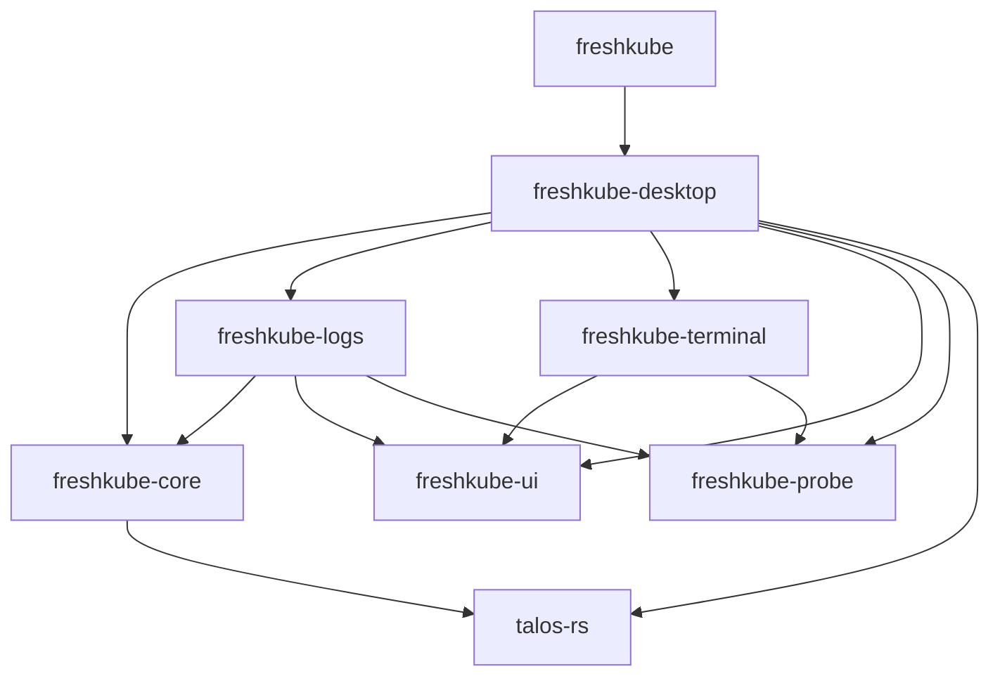

# Build and change speed

Research for [#53](https://github.com/skel84/freshkube/issues/53), measured from
`e27a83d24acbf5ab3656c12b2e3fdfdbf25625ae` on 5 October 2026. This is a research
draft: no application, dependency, profile or CI changes are proposed by this PR.

## What is established

- Desktop contains 88,357 Rust lines across 186 files, including tests. Core is
  40,695 lines across 81 files. Splitting a file does not change the compilation
  unit; splitting a crate still invalidates its dependants when it changes.
- The shared UI and core are low in the dependency graph. Their edits reach
  desktop and the app binary. A feature crate's isolated test command can avoid
  desktop; a full app build cannot assume the same saving.
- Four recent successful CI checks took 315–355 seconds. The ordinary test step
  accounted for 137–158 seconds; stress checks took another 57–91 seconds.
- Local workspace crates retain full debug information, while CI explicitly
  requests line tables. This is a configuration candidate to measure first.
- Cargo already defaults to unpacked debug information on macOS. Adding that
  setting explicitly is not a demonstrated optimization.

Local timings and the final ranking will be filled in as the approved build
sessions finish. Missing measurements below are not estimates of a gain.

## Measurement conditions

The machine is an Intel Core i7-9750H (12 logical CPUs), 16 GiB RAM, with
Homebrew Rust 1.98.1 / LLVM 22.1.8, Apple linker 1115.7.3 and Homebrew LLD 23.1.2.
There was no `target/` before the first build. Registry sources were already
present, so this is an empty-artifact build, not a cold download experiment.

Every Cargo command uses this worktree's own `target/`, with `CARGO_TARGET_DIR`
unset and `CARGO_BUILD_JOBS=2`. The lead grants build slots. Timed commands start
only below a one-minute load of 10. Profile comparisons need repeated alternating
runs in one session; machine load and warm-up runs are recorded separately.

The cold run started at 09:13 UTC with no other Cargo/rustc process. Another
approved build later overlapped it. At approximately 09:42 UTC the lead reported
stopping a Docker VM that had been consuming about four cores. Consequently this
cold sample has changing contention; do not compare it with later quiet runs to
claim an optimization. The load history and compiler-process samples are retained
with the local measurement records.

Nightly, sccache, nextest, cargo-llvm-lines, cargo-bloat and sold are not installed.
No tool has been installed for this research. Stable Cargo's timing report
separates compilation units; it does not prove a split between type checking,
monomorphization and LLVM inside one unit.

| Baseline | Result |
| --- | --- |
| Empty-artifact `cargo build --locked --timings` | Running; start load 6.91, no other Cargo/rustc process at start |
| Desktop one-line edit → build / test compile / clippy | Pending |
| Core one-line edit → build / package test compile | Pending |
| UI one-line edit → build / package test compile | Pending |
| Workspace test binaries and link cost | Pending |
| Build + test + clippy artifact size | Pending |

## Workspace dependency graph

This graph comes directly from the eight manifests; it excludes external
dependencies and does not run Cargo. An arrow means “depends on”.

The lockfile contains 1,007 packages, including 996 registry packages, three git
packages and eight workspace packages. This includes other platforms and optional
features: it is not the number compiled for a macOS build.

| Edited crate | Workspace crates potentially rebuilt for the app |
| --- | --- |
| desktop | desktop, app |
| core | core, logs, desktop, app |
| ui | ui, logs, terminal, desktop, app |
| logs | logs, desktop, app |
| terminal | terminal, desktop, app |
| probe | probe, logs, terminal, desktop, app |
| talos-rs | talos-rs, core, logs, desktop, app |

## Recent editing surface

Counted non-merge commits since 5 July 2026: 230. A module counts once per commit;
renames and move-only commits are included, so these are activity indicators, not
independent feature changes. Line counts include tests and comments.

| Desktop module | Rust lines | Commits touching its paths |
| --- | ---: | ---: |
| desktop (shell) | 16,930 | 75 |
| resources | 18,321 | 53 |
| screens | 20,061 | 24 |
| logs (sources remaining in desktop) | 2,747 | 23 |
| monitoring | 9,812 | 14 |
| observability | 10,383 | 12 |

The most frequently changed files are `desktop/mod.rs` (43 commits),
`desktop/tests.rs` (30), `resources/screen/mod.rs` (28) and `desktop/pages.rs` (18).
Any proposal needs to address the shell's real feature wiring rather than just
move infrequently edited helpers.

## CI observations

These are historical observations, not controlled comparisons. The workflow uses
`macos-15`; local Intel/two-job timings must not be compared directly with it.

| Run | Check job | Cache restore | Clippy | Tests | Stress checks |
| --- | ---: | ---: | ---: | ---: | ---: |
| [37286108961](https://github.com/skel84/freshkube/actions/runs/37286108961) | 315 s | 35 s | 42 s | 149 s | 57 s |
| [37286076745](https://github.com/skel84/freshkube/actions/runs/37286076745) | 318 s | 28 s | 41 s | 137 s | 83 s |
| [37284339580](https://github.com/skel84/freshkube/actions/runs/37284339580) | 355 s | 30 s | 50 s | 158 s | 91 s |
| [37283197388](https://github.com/skel84/freshkube/actions/runs/37283197388) | 318 s | 32 s | 36 s | 139 s | 82 s |

Runs 37286108961 and 37284339580 checked the same head, `fd299bd`, yet differed by
40 seconds. Single-run improvements of this size need repeat measurements.

The workflow already skips draft PRs and docs-only changes, runs formatting and
style before compilation, and does not add a redundant ordinary `cargo build`
after `cargo test`. It checks the stress feature separately because enabling it
for ordinary UI tests changes application lifetime.

### Compilation versus test execution

The logs print eight unit-test executables (the app and seven libraries), with
no standalone integration-test files in this checkout. The separate stress
command adds a ninth executable. Doctests are additional rustdoc work, not eight
more persistent Cargo test targets.

| Run | Cargo test compilation + linking | Share of test step | Desktop suite | All unit suites |
| --- | ---: | ---: | ---: | ---: |
| 37286108961 | 104 s | 70% | 37.72 s | 40.00 s |
| 37286076745 | 92 s | 67% | 37.86 s | 40.15 s |
| 37284339580 | 110 s | 70% | 40.77 s | 43.11 s |
| 37283197388 | 95 s | 68% | 35.17 s | 37.75 s |

These compile times are rounded to whole seconds by Cargo; suite durations are
the harness's reported elapsed times. Remaining step time includes starting the
command/binaries and doctests. The first run lists only workspace packages as
`Compiling` in this step: the 104 seconds primarily cover workspace compilation
and linking, with Cargo overhead. CI did not capture per-link timing or a compiler
profile, so attributing a numerical share to LLVM versus the linker would be
unsupported. Local link measurements below must not be projected onto a different
CI architecture as if measured there.

The toolchain action sets `CARGO_INCREMENTAL=0`, and the cache action logs
`cache-workspace-crates: false`. At audit time the repository had 51 caches,
51,008,404,591 bytes (47.51 GiB), and the sampled check restored a 1,243,500,212-byte
archive in a 35-second step. Saving PR caches alone does not retain the workspace
artifacts that this policy removes. The action's documented cleanup also removes
incremental artifacts. [rust-cache behavior](https://github.com/Swatinem/rust-cache#cache-details)

There is no integration-test binary explosion to consolidate here. Nextest still
builds test binaries with `cargo test --no-run`; it could improve scheduling in the
38–43-second execution portion, but cannot remove the 92–110-second compile/link
phase. Its process-per-test execution would need validation with GPUI's harness
and separate doctest coverage. [nextest execution model](https://nexte.st/docs/design/how-it-works/)

Moving clippy and tests into separate jobs can overlap work, but cannot make
clippy's metadata a substitute for linked test objects. It also adds another
runner/cache setup. Treat that as a latency-versus-runner-cost experiment, not a
way to share a single compilation; they already share the same `target/` in one
job.

The stress step's own logs split into 20.87–32.21 seconds of clippy and
35.79–60 seconds of test compilation; its two tests run in 0.01 seconds in the
sampled run. Moving both lint commands to a concurrent lint job could, in an
ideal model with identical setup and cache behavior, remove 63–80 seconds from
the test job's critical path (about 20–23% of these complete checks). This is a
modeled ceiling, not a measured improvement. It increases runner work and cache
traffic; preserve all checks, keep ordinary tests free of the stress feature,
and keep an aggregate required-check result. Repeated workflow runs are needed
to establish the actual benefit.

## Feature work today

| Feature | Implementation and central wiring | Recompile consequence |
| --- | --- | --- |
| An ordinary inspection page | `screens/<feature>/`, declarations/re-exports in `screens/mod.rs`, `Page`/`ScreenKind` and their lists/mappings in `desktop/pages.rs`, factory in `desktop/mod.rs`, navigation/actions where needed, tests and core collection | Desktop for presentation; core and its dependants if domain collection changes |
| A built-in Resources kind | `core/resources/kinds.rs`'s 47-entry catalog and `desktop/resources/navigation.rs`; fixture/test data as needed | Core → logs → desktop → app; no new page or screen factory |
| A discovered custom kind | Existing API discovery and server-printed table path | No source change for ordinary discovered kinds |
| A Resources column | Server-supplied ordinary columns need no registration; a derived column touches `resources/screen/layout.rs`, `source.rs`/`cells.rs`, and possibly `model.rs`/`rows.rs`/`projection.rs` | Desktop, or core too if new collection is required; no page enum edit |
| A diagnostic check | `core/diagnostic_runner.rs` collects evidence and builds typed checks; existing diagnostic presentation consumes the result; tests stay with the owner | Focused core tests avoid desktop; a complete app build still invalidates desktop |

Not every feature needs a new page or a new crate. Preserve the existing
data-driven Resources path. A registration table could reduce repeated page
mappings, but would not itself reduce the desktop compilation unit.

Monitoring's 9,812 lines comprise page 4,067, panel 2,620, derivation 1,857, history
708, colors 299, store 251 and the 10-line module. Its Resources dependency is
concrete: page/history imports `KubeAccess`/`KubeSource`, while the Resources pane
embeds `HistoryView`. A split needs an access seam that preserves connection
identity and request ownership. Observability's 10,383 lines already emit typed
navigation events; remaining seams include shared chart colors, content width,
secrets, snapshot state and instrumentation. These are better starting boundaries
than a crate per page. The two modules contain 96 test attributes (61 monitoring,
35 observability); moving their tests can make their focused commands independent
of the rest of desktop, even if a full app rebuild remains expensive.

`ScreenHandle` already erases views into `AnyView` and lifecycle closures.
`TableSource` is `Sized`, has associated row/key/column types and takes
`Context<Self>`; converting it into `dyn TableSource` is not a mechanical change.
`LogView<S>` similarly instantiates for its sources in desktop. If profiling
identifies these as expensive, first consider moving non-generic body work behind
small typed adapters, retaining domain keys and existing entities. Do not trade
away list virtualization, caching or identity for an unmeasured compile saving.

Do not infer an exponentially nested widget type from a long builder chain:
pinned GPUI's `ParentElement::child` converts its argument to `AnyElement` before
storing it (`gpui-pre` 0.3.7, `src/element.rs`). Entity/listener/source
instantiations still deserve measurement, but generic syntax and source lines
alone do not establish their compile cost.

## Dependency and profile candidates

The manifests deliberately keep GPUI test support in dev-dependencies. Tests
enable `gpui-kit/test-support`, probe counting, log/terminal test readers and
core's Tokio test utilities. Resolver 2 keeps these out of ordinary builds. A
first test build therefore has additional feature variants to compile; a second
ordinary build should reuse its own variants. This distinction needs fingerprint
evidence before calling it cache thrashing. [Cargo feature resolution](https://doc.rust-lang.org/cargo/reference/features.html#feature-resolver-version-2)

`talos-rs/build.rs` writes generated protobufs into `OUT_DIR` and declares
`proto/`, `PROTOC` and `PROTOC_INCLUDE` as rerun inputs. Source inspection shows no
timestamp or generated file written into the source tree. Repeated fingerprint
logs will test whether this correctly remains fresh after unrelated edits.

One cold-build hypothesis is redundant TLS provider compilation. The direct
`tokio-rustls = "0.26"` dependency enables its AWS-LC default; workspace Rustls
also enables ring, which `core/resources/connection.rs` and
`cluster_overview.rs` explicitly install. This is not yet proof that AWS-LC can
be removed: inspect all activating feature paths and TLS consumers, measure its
critical-path contribution, and validate connections before a separate change.
Similarly, the lockfile's two resvg versions come from GPUI and Component;
resolving that duplication is an upstream compatibility task, not a blind lockfile
edit.

Codegen-unit, incremental and alternate-backend experiments must preserve the
required optimized dependency profile. Changing code generation can affect
runtime performance and needs before/after stress measurements before adoption.
Debug line tables trade variable/type inspection for source-line backtraces;
`debug = 0` also loses that line information. Explicit `split-debuginfo =
"unpacked"` already matches the macOS commands emitted by this checkout. [Rust codegen options](https://doc.rust-lang.org/rustc/codegen-options/index.html)

## Candidates to rank after measurement

1. **Configuration:** compare workspace line tables with full debug info, while
   preserving dependency `opt-level = 3` and workspace incremental compilation.
2. **CI:** separate test compilation from execution in timing evidence; examine
   feature-specific cache reuse and the cost of the stress checks before changing
   the cache policy or runner.
3. **Structure:** evaluate monitoring and observability as focused-test boundaries
   (20,195 lines combined), with explicit access/request/event seams and retained
   lifecycle owners. Do not promise faster complete app rebuilds from a move.
4. **Generic code:** inspect concrete instantiations before replacing typed GPUI
   APIs with dynamic dispatch. The existing shared table and log view are generic;
   their bodies may still be compiled in the consuming crate.
5. **Tools:** measure the already-installed Apple and LLVM linkers; keep sccache,
   nextest, nightly profiling and alternative codegen as unmeasured follow-ups
   unless the lead authorizes installation and the required runtime checks.

### Cache experiment scope

The lead has relayed approval to install sccache after the cold build, with a
private cache and shell-only `RUSTC_WRAPPER`; stop its server at the end. This
experiment must distinguish three cases: ordinary local workspace builds keep
incremental compilation; new worktrees may reuse eligible dependency compiles;
CI already disables incremental and may reuse unchanged workspace libraries.
The last case does not make a changed desktop library or linked test executable
a cache hit.

The current sccache release is 0.18.0. Its Rust parser excludes incremental
invocations and system-linker crate types. Cargo's unit-test invocations normally
omit an `rlib` crate type, so test harness codegen/linking needs separate evidence,
not a cache promise. The parser accepts metadata-only library compilation even
though the Rust caveats document still says `link` is required; verify actual
hit/miss reasons with the installed release before counting clippy savings.
[sccache 0.18.0 Rust parser](https://github.com/mozilla/sccache/blob/v0.18.0/src/compiler/rust.rs)

Its GitHub Actions backend is supported through `SCCACHE_GHA_ENABLED=on` and
runner-provided cache credentials; read-only cache mode is available. No remote
backend or CI cache is modified in this local experiment. Rank a CI trial on
observed cacheable units and unchanged-code hits, including transfer/setup time;
do not subtract the entire test-compile step from CI time.
[sccache GitHub Actions backend](https://github.com/mozilla/sccache/blob/v0.18.0/docs/GHA.md)

Keep each worktree's writable target separate. A read-only dependency seed would
need a verified compiler/profile/target/feature key and must exclude workspace
artifacts and stale build-script paths. Copying or hard-linking a complete target
tree is not an acceptable shortcut around the stale-workspace failure documented
in `AGENTS.md`. A content-addressed compiler cache is the candidate to measure.

Nightly has conditional approval only: if repeated one-line desktop timings put
codegen at roughly one-third or more, compare an isolated nightly's LLVM and
workspace-only Cranelift backends. Keep Homebrew Cargo, global PATH and global
configuration untouched; retain dependency LLVM optimization; test panic/test
support and remove the isolated toolchain afterward. If the measured share is
smaller, record that bound and skip the installation.

## Technical references

- [Cargo profiles](https://doc.rust-lang.org/cargo/reference/profiles.html):
  workspace overrides, debug information, incremental compilation and macOS
  unpacked debug information.
- [Cargo timings](https://doc.rust-lang.org/cargo/reference/timings.html): the
  meaning and limits of per-unit build timing reports.
- [GPUI Kit coding guides](https://gpui-kit.com/docs/coding-guides.md): capability
  boundaries, acyclic dependencies and preserved state ownership.
