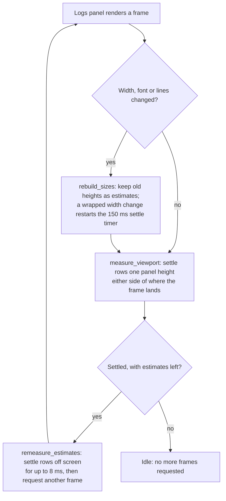

# Long lists

A list that can outgrow a screen renders only the rows a frame can show. Fixed-height rows use `uniform_list`, which lays out one row and multiplies. Rows whose height depends on the width, such as wrapped log lines, use `VirtualList` with measured heights. During a live resize they measure only the rows on screen and catch up the rest once the width holds.

## Rules for every long list

1. **Virtualize or cap.** A list that can pass a few hundred rows, or grows without bound, is virtualized. A plain list needs a hard cap, like the Operations page's 256 progress lines.
2. **Prefer fixed heights.** Keep table rows to one line and truncate them, with the full text in a tooltip or the detail pane. Then `uniform_list` does all the work.
3. **Measure heights by layout, never by arithmetic.** `VirtualList` trusts the heights it is given, and a wrong height overlaps rows. GPUI rounds lengths to device pixels, rounds measured text up and snaps line height. Lay rows out with `layout_as_root` rather than computing heights from character counts or font metrics.
4. **Measure what the frame can show; budget the rest.** Work on rows off screen waits until the input holds (a resize, a font change), then runs within a per-frame time budget.
5. **Cache by identity and geometry.** Key cached measurements and display data by row identity and by the geometry they depend on. An appended batch measures only its new rows.
6. **Anchor to a row, not an offset.** When heights change above the viewport, keep the row being read in place by its identity.
7. **Prove it with probes, measure it in release.** A headless test counts layouts with `probe::hit` and `probe::count`. Performance numbers come from release builds, because debug GPUI draws about 14× slower ([K12](GPUI_FRICTION.md#k12-unoptimised-builds-draw-about-14-slower)).

## Where each list stands

| List | Size | Rendering | Status |
| --- | --- | --- | --- |
| Resources page (Kubernetes kinds) | up to thousands of rows | `uniform_list` | Fine |
| Processes, Storage, Network and Workloads tables | hundreds to thousands | `uniform_list` | Fine |
| Log views (`LogView`: Talos logs and pod logs) | up to 8 MiB of lines, tens of thousands | `VirtualList` with measured heights | Fine. A wrapped resize lays out only the rows on screen ([below](#wrapped-rows-during-a-resize)) |
| Detail pane YAML | thousands of lines for a large object | `uniform_list` of unwrapped lines, as wide as the longest line. A line draws at most 2,000 characters, and search marks at most 10,000 matches | Fine. Wrapping would need the measured approach below |
| Detail pane Events and Overview | an object's events; its labels and annotations | plain children in a scroll area: the newest 200 events, at most 200 labels and 200 annotations | Fine while capped. The rest stay in the YAML |
| Sidebar Custom Resources | one row per API group, tens on a typical cluster (58 on the live one), and the kinds of each open group | plain children of the sidebar's scroll area: at most 300 groups and 200 kinds per group, then a "more not shown" row. Labels, ids and tooltips are derived once when discovery answers | Fine while capped. A cluster with more groups would need the sidebar as a `uniform_list` |
| Command-K kind palette | the built-in kinds and every discovered custom kind: tens, at most the sidebar's caps | Kit `Command`, a `v_virtual_list`. The catalogue is built once when the palette opens; Kit filters it as the query changes | Fine |
| Diagnostics, Security, etcd, Lifecycle, Operations progress | bounded: usually tens of rows; at most 256 Lifecycle nodes or Operations lines | plain children in a scroll area | Fine while bounded |

## Wrapped rows during a resize

With line wrapping on, the logs panel used to re-lay out every retained line on each resize step. In talos-pilot's GPUI frontend, where Freshkube's logs panel comes from, that cost about 115 ms per step at 5,000 lines. Measuring only the rows that can be on screen, then re-measuring the rest once the width holds, brought it to 44 ms, the profiling harness's floor. Rows on screen keep exact heights.

The change was built and measured in that frontend on 2026-10-01, then applied to Freshkube's logs panel (then `logs.rs`, now the `logs/` module) unchanged except for names. The numbers below come from that measurement and have not been repeated on Freshkube's build.

### Results

A release build of the offline `fixture` example with 5,000 log lines, swept 306 times between 900 and 1,400 px wide:

| Configuration | Time per resize step (ms) | Log panel render, share of main thread |
| --- | --- | --- |
| Wrap on, before | 115 | 75% (6,800 of 9,125 samples) |
| Wrap on, after | 44 | 3% (271 of 8,868 samples) |
| Wrap off, for comparison | 43 | 3% (256 of 9,709 samples) |

The scripted resize itself takes about 43 ms per step, so 44 ms means the app keeps up with it. After one resize, CPU rises to about 24% for roughly a second while rows off screen catch up, then drops back to the 2% idle baseline.

### How it works



During a drag, every frame goes through `rebuild_sizes` and then lays out only the rows on screen. 150 ms after the last width change, the timer sets `settled`, and the following frames catch up the rows off screen 8 ms at a time.

### Implementation

It lives on the shared `LogView` in `crates/freshkube-desktop/src/logs/measure.rs`, so every log source, Talos services and later pod logs, gets it. Rows are still laid out exactly as the list draws them (`render_row(ix, true, cx).layout_as_root(..)`); the change limits when that runs. Nothing estimates heights from character counts, for the reason in rule 3.

| Piece | What it does |
| --- | --- |
| `RowMeasurement` | A cached row size with the wrap width it was measured at, `None` when unwrapped |
| `row_exact`, `settled`, `settle` | Whether each row is measured at the current geometry or keeps an old height as an estimate; whether a resize is in progress, and its timer |
| `measure_rows` | Runs from `render`. Rebuilds sizes only when the measurement key changed, then settles the rows on screen. Once settled, it catches up the rest and requests another frame while estimates remain. It restores the scroll anchor only when a height changed |
| `rebuild_sizes` | Only a rem, font or wrap-mode change clears the cache. A wrapped width change keeps old heights as estimates, sets `settled = false` and replaces the `RESIZE_SETTLE` (150 ms) timer; dropping the old `Task` cancels it. The batch fast path (`VisibleDelta::Extended`) survives a width change |
| `measure_row` | The only place a row is laid out. Counts `probe::hit("logs.measure")` |
| `settle_row` | Swaps one estimate for an exact height, from the cache when it already holds the current wrap width |
| `measure_viewport` | Works out where the frame lands (the tail, a revealed row, the review anchor or the current offset) and settles one panel height of rows each way. The panel height bounds the viewport whatever toolbar and notices are open |
| `remeasure_estimates` | Settles rows off screen for up to `REMEASURE_BUDGET` (8 ms) per frame. The buffer keeps up to 8 MiB (`MAX_RETAINED_BYTES`), too many lines for one frame |

### Pitfalls

Most of the risk is in the scroll anchor. Keep these rules:

- **Capture the anchor in `measure_rows` only when the key is unchanged.** When the key changed, the review has already mutated, for example a batch dropped rows, so offsets would map onto the wrong IDs. The existing event sites (viewport prepaint, batch arrival) still capture before they mutate.
- **Skip that capture while `pending_reveal` is set.** The restore is skipped then too, and a leftover anchor would pull the view back on a later batch.
- **Restore only when a height changed.** Capturing and restoring with nothing changed only adds floating-point drift to the scroll offset.
- **Never mark unwrapped rows stale on a width change.** They are measured at `MaxContent`, so the cache stays valid; only `sizes[..].width` changes.
- **Settle with a GPUI timer, not an `Instant` comparison.** GPUI's test executor uses a fake clock, so a wall-clock check would never settle in tests. `Instant` is fine for the per-frame budget.
- **Request frames only while settled and estimates remain.** `window.request_animation_frame()` from render notifies the panel next frame; an idle panel must stop asking.
- **Over-cover the viewport.** The span is the whole panel height, so a frame never paints an estimated row, whatever chrome is open.

### Test

`live_resize_lays_out_rows_on_screen_and_settles_the_rest_afterwards` in `logs/tests.rs` covers the behavior, with a `settle` helper that advances the fake clock past `RESIZE_SETTLE` and delivers frames until no row is estimated. GPUI's test text system gives every character a fixed advance, so wrapping is real, and row 90 of the test fixture, a long line, really changes height with width.

The test reviews from the top so row 90 is off screen, then checks four things:

1. A resize to 900 px lays out fewer than half the rows.
2. Every row on screen is exact, while row 90 keeps its old height as an estimate.
3. After settling, row 90 is shorter and the scroll offset is still 0.
4. Resizing back to 620 px and settling reproduces the original heights exactly.

As a mutation check, deleting the `measure_viewport` call in `measure_rows` makes it fail with "a resize frame laid out 0 of 120 rows".

### Measuring it

Profile a release build of the offline `fixture` example. It loads no cluster credentials. On macOS, with the screen unlocked, since a covered window or locked screen stops GPUI drawing:

1. Apply two temporary patches, and revert both afterwards:
    - In `desktop/mod.rs`, drop `#[cfg(debug_assertions)]` above the `FRESHKUBE_PAGE` check, so the page switch works in release.
    - In `fixture.rs`, read the line count in `logs()` from an environment variable (here `PERF_FIXTURE_LOGS`) instead of the fixed 170.
2. Build with `cargo build --release -p freshkube-desktop --example fixture`.
3. Launch with `PERF_FIXTURE_LOGS=5000 FRESHKUBE_PAGE=logs target/release/examples/fixture &` and note the PID.
4. Run the resize script below against that PID, with `sample <pid> 12 -file wrap.txt` running at the same time. The terminal needs Accessibility permission to drive System Events.
5. In the sample, compare main-thread samples under `LogView::render` with idle samples under `__CFRunLoopServiceMachPort`.
6. After the sweep, resize once and run `top -l 4 -s 1 -pid <pid> -stats pid,cpu`. CPU should spike for about a second, then return to idle.

The script targets the window by PID, so no other app is touched. It makes 306 resizes:

```applescript
on run argv
  set pidNum to (item 1 of argv) as integer
  tell application "System Events"
    tell (first process whose unix id is pidNum)
      repeat 3 times
        repeat with w from 900 to 1400 by 10
          set size of window 1 to {w, 860}
        end repeat
        repeat with w from 1400 to 900 by -10
          set size of window 1 to {w, 860}
        end repeat
      end repeat
    end tell
  end tell
end run
```

AppleScript limits the sweep to about 43 ms per step. Below that, step time stops improving, so judge by main-thread busy time.

### Left open

Each resize step still renders twice, because the viewport learns its new width in prepaint. Wrapped rows can look wrong for one frame per step.
