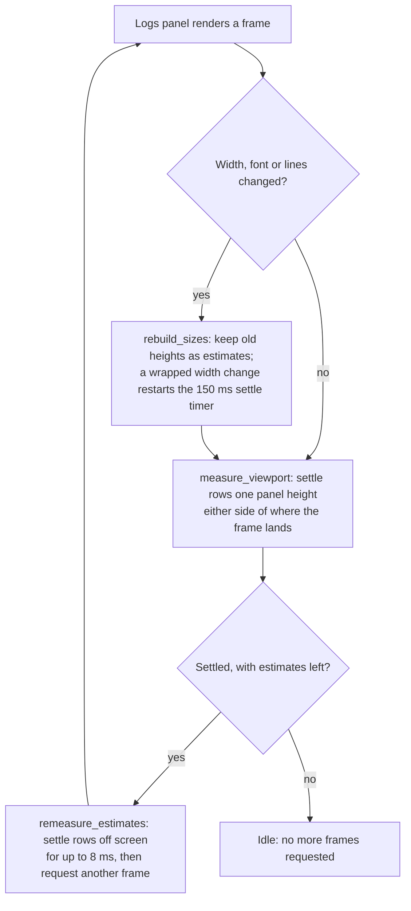

# Long lists

A list that can outgrow a screen renders only the rows a frame can show. Fixed-height rows use `uniform_list`, which lays out one row and multiplies. Rows whose height depends on the width, such as wrapped log lines, use `VirtualList` with measured heights. During a live resize they measure only the rows on screen and catch up the rest once the width holds.

## Rules for every long list

1. **Virtualize or cap.** A list that can pass a few hundred rows, or grows without bound, is virtualized. A plain list needs a hard cap, like the Operations page's 256 progress lines.
2. **Prefer fixed heights.** Keep table rows to one line and truncate them, with the full text in a tooltip or the detail pane. Then `uniform_list` does all the work.
3. **Measure heights by layout, never by arithmetic.** `VirtualList` trusts the heights it is given, and a wrong height overlaps rows. GPUI rounds lengths to device pixels, rounds measured text up and snaps line height. Lay rows out with `layout_as_root` rather than computing heights from character counts or font metrics.
4. **Measure what the frame can show; budget the rest.** Work on rows off screen waits until the input holds (a resize, a font change), then runs within a per-frame time budget.
5. **Cache by identity and geometry.** Key cached measurements and display data by row identity and by the geometry they depend on. An appended batch measures only its new rows.
6. **Anchor to a row, not an offset.** When heights change above the viewport, keep the row being read in place by its identity.
7. **Prove it with probes, measure it in release.** A headless test counts layouts with `probe::hit` and `probe::count`. Performance numbers come from release builds, because debug GPUI draws about 14× slower ([K12](GPUI_FRICTION.md#k12-unoptimised-builds-draw-about-14-slower)).

## Where each list stands

| List | Size | Rendering | Status |
| --- | --- | --- | --- |
| Resources page (Kubernetes kinds) | up to thousands of rows | `uniform_list` | Fine |
| Processes, Storage, Network and Workloads tables | hundreds to thousands | `uniform_list` | Fine |
| Talos logs panel | up to 8 MiB of lines, tens of thousands | `VirtualList` with measured heights | With wrapping on, every resize step re-lays out every line. [The fix below](#wrapped-rows-during-a-resize) is not applied yet |
| Pod logs (roadmap step 5) | same as the logs panel | reuses the log view | Gets the fix with the shared view |
| Detail pane YAML and Events (roadmap step 3) | thousands of lines for a large object | not built yet | Unwrapped lines can use `uniform_list`. Wrapped lines need the measured approach below |
| Diagnostics, Security, etcd, Lifecycle, Operations progress | bounded: usually tens of rows; at most 256 Lifecycle nodes or Operations lines | plain children in a scroll area | Fine while bounded |

## Wrapped rows during a resize

With line wrapping on, the logs panel re-lays out every retained line on each resize step. In talos-pilot's GPUI frontend that cost about 115 ms per step at 5,000 lines. Measuring only the rows that can be on screen, then re-measuring the rest once the width holds, brought it to 44 ms, the profiling harness's floor. Rows on screen keep exact heights.

The change was built and measured on 2026-10-01 in that frontend, before it became Freshkube. Freshkube's `crates/freshkube-desktop/src/logs.rs` still has the original `measure_rows`, which clears the cache on any width change. The steps below apply to it unchanged except for names. Apply it to the shared log view before pod logs are built on it (roadmap step 5), so both get it. Once it lands, replace the code here with pointers to the functions.

### Results

A release build of the offline `fixture` example with 5,000 log lines, swept 306 times between 900 and 1,400 px wide:

| Configuration | Time per resize step (ms) | Log panel render, share of main thread |
| --- | --- | --- |
| Wrap on, before | 115 | 75% (6,800 of 9,125 samples) |
| Wrap on, after | 44 | 3% (271 of 8,868 samples) |
| Wrap off, for comparison | 43 | 3% (256 of 9,709 samples) |

The scripted resize itself takes about 43 ms per step, so 44 ms means the app keeps up with it. After one resize, CPU rises to about 24% for roughly a second while rows off screen catch up, then drops back to the 2% idle baseline.

### How it works



During a drag, every frame goes through `rebuild_sizes` and then lays out only the rows on screen. 150 ms after the last width change, the timer sets `settled`, and the following frames catch up the rows off screen 8 ms at a time.

### Implementation

The starting point is `measure_rows` in `logs.rs`. It lays out every row with `render_row(ix, true, cx).layout_as_root(..)`, caches sizes by entry ID in `row_measurements`, and clears that cache on any width change. The change keeps that exact layout but limits when it runs. Nothing estimates heights from character counts, for the reason in rule 3.

#### 1. Record each measurement's wrap width

Next to `ReviewAnchor`, add the measurement type and two constants:

```rust
/// A row's size and the wrap width it was measured at; `None` when
/// unwrapped, where rows take their natural width whatever the pane's.
#[derive(Clone, Copy)]
struct RowMeasurement {
    wrap_width: Option<Pixels>,
    size: Size<Pixels>,
}

/// How long a wrapped pane's width must hold before rows off screen are
/// remeasured. Until then a live resize lays out only the rows it shows.
const RESIZE_SETTLE: Duration = Duration::from_millis(150);
/// Main-thread time per frame for remeasuring rows off screen.
const REMEASURE_BUDGET: Duration = Duration::from_millis(8);
```

#### 2. Add per-row state to `LogPanel`

```rust
row_measurements: std::collections::BTreeMap<u64, RowMeasurement>,
/// Whether each row in `sizes` is measured at the current geometry.
/// The others keep their last height as an estimate.
row_exact: Vec<bool>,
/// Whether estimated rows may be remeasured: no resize is in progress.
settled: bool,
settle: Option<Task<()>>,
```

Initialize them to `Vec::new()`, `true` and `None`. Wherever `sizes` and `row_widths` are reset (`set_target`, `set_fixture`), also call `self.row_exact.clear()`.

#### 3. Turn `measure_rows` into an orchestrator

It no longer returns early while estimated rows remain. It rebuilds sizes only when the key changed and settles the rows on screen. Once settled, it catches up the rest:

```rust
fn measure_rows(&mut self, window: &mut Window, cx: &mut Context<Self>) {
    let key = MeasurementKey {
        width: self.width.unwrap_or_else(|| window.bounds().size.width),
        rem: window.rem_size(),
        font: cx.theme().mono_font_family.clone(),
        wrapped: self.wrapped,
        revision: self.review.revision,
    };
    let unchanged = self.measured.as_ref() == Some(&key);
    if unchanged && !self.row_exact.contains(&false) {
        return;
    }
    if unchanged {
        // Only estimated rows are left: a scroll may have exposed some,
        // or the resize settled. Anchor on what is on screen now.
        if self.pending_reveal.is_none() {
            self.capture_anchor();
        }
    } else {
        self.rebuild_sizes(&key, window, cx);
    }
    let mut changed = !unchanged;
    changed |= self.measure_viewport(&key, window, cx);
    if self.settled {
        changed |= self.remeasure_estimates(&key, window, cx);
        if self.row_exact.contains(&false) {
            window.request_animation_frame();
        }
    }
    let width = key.width;
    self.measured = Some(key);
    if !changed {
        return;
    }
    self.unwrapped_width = self
        .row_widths
        .iter()
        .fold(width, |widest, width| widest.max(*width));
    if !self.following && self.pending_reveal.is_none() {
        self.restore_anchor();
    }
    if self.following {
        self.pending_reveal = self
            .review
            .visible
            .len()
            .checked_sub(1)
            .map(|ix| self.review.id(ix));
    }
}
```

#### 4. Move the rebuild into `rebuild_sizes`

This is the old body of `measure_rows`, with three changes:

- Only a rem, font or wrap-mode change clears the cache. A width change does not.
- A wrapped width change sets `settled = false` and replaces the settle timer. Dropping the old `Task` cancels it, so only the last resize step's timer fires.
- The batch fast path (`VisibleDelta::Extended`) survives a width change. Kept rows get the new width and, when wrapped, become estimates.

```rust
/// Rebuilds `sizes` for a new revision or geometry. Rows already
/// measured at another wrap width keep that height as an estimate.
fn rebuild_sizes(
    &mut self,
    key: &MeasurementKey,
    window: &mut Window,
    cx: &mut Context<Self>,
) {
    let previous = self.measured.as_ref();
    let measurements_stale = previous.is_none_or(|previous| {
        previous.rem != key.rem
            || previous.font != key.font
            || previous.wrapped != key.wrapped
    });
    let resized = previous.is_some_and(|previous| previous.width != key.width);
    if measurements_stale {
        self.row_measurements.clear();
    } else if resized && key.wrapped {
        // A live resize changes the width every frame; reshaping every
        // retained row each time is what made it sluggish.
        self.settled = false;
        self.settle = Some(cx.spawn(async move |weak, cx| {
            cx.background_executor().timer(RESIZE_SETTLE).await;
            let _ = weak.update(cx, |this, cx| {
                this.settled = true;
                cx.notify();
            });
        }));
    }
    let delta = self.review.take_delta();
    // Measurements of evicted lines are dead weight; sweep them only
    // once they outnumber what could be live.
    if self.row_measurements.len() > self.review.logs.buffer().entries().len() {
        let retained: BTreeSet<_> = self
            .review
            .logs
            .buffer()
            .entries()
            .iter()
            .map(|entry| entry.sequence())
            .collect();
        self.row_measurements.retain(|id, _| retained.contains(id));
    }
    // Rows that left the front and ones that joined the end are the
    // only changes between batches; the sizes in between still hold.
    let rows = self.review.visible.len();
    let kept = match delta {
        VisibleDelta::Extended { dropped, added }
            if !measurements_stale
                && dropped <= self.sizes.len()
                && self.sizes.len() - dropped + added == rows
                && self.row_widths.len() == self.sizes.len()
                && self.row_exact.len() == self.sizes.len() =>
        {
            Some((dropped, rows - added))
        }
        _ => None,
    };
    let first_new = match kept {
        Some((dropped, first_new)) => {
            let sizes = Rc::make_mut(&mut self.sizes);
            sizes.drain(..dropped);
            self.row_widths.drain(..dropped);
            self.row_exact.drain(..dropped);
            if resized {
                for row in sizes.iter_mut() {
                    row.width = key.width;
                }
                // Unwrapped rows keep their natural width at any pane width.
                if key.wrapped {
                    self.row_exact.fill(false);
                }
            }
            first_new
        }
        None => {
            self.sizes = Rc::new(Vec::with_capacity(rows));
            self.row_widths.clear();
            self.row_exact.clear();
            0
        }
    };
    let wrap_width = key.wrapped.then_some(key.width);
    for ix in first_new..rows {
        let (measured, exact) = match self.row_measurements.get(&self.review.id(ix)) {
            Some(cached) => (cached.size, cached.wrap_width == wrap_width),
            None => (self.measure_row(ix, key, window, cx), true),
        };
        self.row_widths.push(measured.width);
        self.row_exact.push(exact);
        Rc::make_mut(&mut self.sizes).push(size(key.width, measured.height));
    }
}
```

#### 5. Add `measure_row` and `settle_row`

`measure_row` is the old cache-miss branch. `settle_row` swaps one estimate for an exact height, using the cache when it already holds the current wrap width.

```rust
/// Lays out row `ix` as the list draws it and caches its size.
/// VirtualList trusts supplied heights, so this measures the actual
/// styled row, not character counts.
fn measure_row(
    &mut self,
    ix: usize,
    key: &MeasurementKey,
    window: &mut Window,
    cx: &mut Context<Self>,
) -> Size<Pixels> {
    crate::desktop::probe::hit("logs.measure");
    let available = size(
        if key.wrapped {
            AvailableSpace::Definite(key.width)
        } else {
            AvailableSpace::MaxContent
        },
        AvailableSpace::MinContent,
    );
    let mut row = self.render_row(ix, true, cx).into_any_element();
    let measured = row.layout_as_root(available, window, cx);
    self.row_measurements.insert(
        self.review.id(ix),
        RowMeasurement {
            wrap_width: key.wrapped.then_some(key.width),
            size: measured,
        },
    );
    measured
}

/// Replaces row `ix`'s estimated height with its measured one and
/// returns whether the height changed.
fn settle_row(
    &mut self,
    ix: usize,
    key: &MeasurementKey,
    window: &mut Window,
    cx: &mut Context<Self>,
) -> bool {
    if self.row_exact[ix] {
        return false;
    }
    let wrap_width = key.wrapped.then_some(key.width);
    let measured = match self.row_measurements.get(&self.review.id(ix)) {
        Some(cached) if cached.wrap_width == wrap_width => cached.size,
        _ => self.measure_row(ix, key, window, cx),
    };
    self.row_exact[ix] = true;
    self.row_widths[ix] = measured.width;
    let row = &mut Rc::make_mut(&mut self.sizes)[ix];
    let changed = row.height != measured.height;
    row.height = measured.height;
    changed
}
```

#### 6. Add `measure_viewport`

It works out where this frame will land, then settles one panel height of rows forward and one backward from there. The panel height is an upper bound on the viewport, whatever toolbar and notices are open.

```rust
/// Settles every estimated row the next frame can show, so neither a
/// live resize nor a scroll paints an estimated height.
fn measure_viewport(
    &mut self,
    key: &MeasurementKey,
    window: &mut Window,
    cx: &mut Context<Self>,
) -> bool {
    let rows = self.sizes.len();
    if rows == 0 || !self.row_exact.contains(&false) {
        return false;
    }
    // Where the frame will scroll to: the tail, a revealed row, the
    // review anchor (row 0 once evicted), or the current offset.
    let (first, within) = if self.following {
        (rows - 1, px(0.))
    } else if let Some(ix) = self
        .pending_reveal
        .and_then(|id| self.review.row_for_id(id))
    {
        (ix, px(0.))
    } else if let Some(anchor) = self.review_anchor {
        self.review
            .row_for_id(anchor.id)
            .map_or((0, px(0.)), |ix| (ix, anchor.within_row))
    } else {
        let mut offset = -self.scroll.offset().y;
        let mut ix = 0;
        while ix + 1 < rows && offset >= self.sizes[ix].height {
            offset -= self.sizes[ix].height;
            ix += 1;
        }
        (ix, offset.max(px(0.)))
    };
    // The whole panel bounds the viewport, whatever chrome is open;
    // measure that much on both sides of where the frame lands.
    let span = self
        .panel_height
        .unwrap_or_else(|| window.bounds().size.height);
    let mut changed = false;
    let mut covered = -within;
    let mut ix = first;
    while ix < rows && covered < span {
        changed |= self.settle_row(ix, key, window, cx);
        covered += self.sizes[ix].height;
        ix += 1;
    }
    let mut covered = px(0.);
    let mut ix = first;
    while ix > 0 && covered < span {
        ix -= 1;
        changed |= self.settle_row(ix, key, window, cx);
        covered += self.sizes[ix].height;
    }
    changed
}
```

#### 7. Add `remeasure_estimates`

The 8 ms budget matters: the log buffer keeps up to 8 MiB (`MAX_RETAINED_BYTES`), which can be tens of thousands of lines, too many to remeasure in one frame.

```rust
/// Settles estimated rows off screen within a frame budget, once the
/// width has held.
fn remeasure_estimates(
    &mut self,
    key: &MeasurementKey,
    window: &mut Window,
    cx: &mut Context<Self>,
) -> bool {
    let started = Instant::now();
    let mut changed = false;
    for ix in 0..self.sizes.len() {
        if self.row_exact[ix] {
            continue;
        }
        changed |= self.settle_row(ix, key, window, cx);
        if started.elapsed() >= REMEASURE_BUDGET {
            break;
        }
    }
    changed
}
```

### Pitfalls

Most of the risk is in the scroll anchor. Keep these rules:

- **Capture the anchor in `measure_rows` only when the key is unchanged.** When the key changed, the review has already mutated, for example a batch dropped rows, so offsets would map onto the wrong IDs. The existing event sites (viewport prepaint, batch arrival) still capture before they mutate.
- **Skip that capture while `pending_reveal` is set.** The restore is skipped then too, and a leftover anchor would pull the view back on a later batch.
- **Restore only when a height changed.** Capturing and restoring with nothing changed only adds floating-point drift to the scroll offset.
- **Never mark unwrapped rows stale on a width change.** They are measured at `MaxContent`, so the cache stays valid; only `sizes[..].width` changes.
- **Settle with a GPUI timer, not an `Instant` comparison.** GPUI's test executor uses a fake clock, so a wall-clock check would never settle in tests. `Instant` is fine for the per-frame budget.
- **Request frames only while settled and estimates remain.** `window.request_animation_frame()` from render notifies the panel next frame; an idle panel must stop asking.
- **Over-cover the viewport.** The span is the whole panel height, so a frame never paints an estimated row, whatever chrome is open.

### Test

One headless UI test covers the behavior. GPUI's test text system gives every character a fixed advance, so wrapping is real. Row 90 of the logs test fixture, a long line, really changes height with width.

The test reviews from the top so row 90 is off screen, then checks four things:

1. A resize to 900 px lays out fewer than half the rows.
2. Every row on screen is exact, while row 90 keeps its old height as an estimate.
3. After settling, row 90 is shorter and the scroll offset is still 0.
4. Resizing back to 620 px and settling reproduces the original heights exactly.

Add it to `mod ui_tests` in `logs.rs`. It needs the `probe::hit("logs.measure")` call in `measure_row`; `probe::count` is thread-local and exists only under `#[cfg(test)]`.

```rust
/// Lets a resize settle, then delivers frames until no row is estimated.
fn settle(cx: &mut TestAppContext, panel: &Entity<LogPanel>, handle: WindowHandle<Root>) {
    cx.executor().advance_clock(super::RESIZE_SETTLE);
    cx.run_until_parked();
    for _ in 0..64 {
        let settled = cx
            .update_window(handle.into(), |_, window, cx| {
                window.simulate_next_frame(cx);
                window.render_frame(cx);
                !panel.read(cx).row_exact.contains(&false)
            })
            .unwrap();
        if settled {
            return;
        }
    }
    panic!("estimated rows never settled");
}

#[gpui_kit::test]
fn live_resize_lays_out_rows_on_screen_and_settles_the_rest_afterwards(
    cx: &mut TestAppContext,
) {
    let (_runtime, panel, handle) = mount(cx);
    let measured = || crate::desktop::probe::count("logs.measure");
    let tall = SharedString::from("log-line-1-90");
    let mut original = Vec::new();
    let mut before = 0;
    cx.update_window(handle.into(), |_, window, cx| {
        window.render_frame(cx);
        window.render_frame(cx);
        // Review from the top, so the tall row 90 is off screen.
        panel.update(cx, |view, cx| view.navigate(isize::MIN, false, cx));
        window.render_frame(cx);
        window.render_frame(cx);
        let view = panel.read(cx);
        assert!(!view.following);
        assert_eq!(view.scroll.offset().y, px(0.));
        assert!(window.try_find(tall.clone()).is_none());
        original = view.sizes.iter().map(|row| row.height).collect::<Vec<_>>();
        before = measured();
    })
    .unwrap();
    cx.simulate_window_resize(handle.into(), size(px(900.), px(760.)));
    cx.update_window(handle.into(), |_, window, cx| {
        window.render_frame(cx);
        window.render_frame(cx);
        let view = panel.read(cx);
        let laid_out = measured() - before;
        assert!(
            laid_out > 0 && laid_out < original.len() / 2,
            "a resize frame laid out {laid_out} of {} rows",
            original.len()
        );
        assert!(!view.settled);
        // Off screen, the tall row keeps its last height until the
        // width holds.
        assert!(!view.row_exact[90]);
        assert_eq!(view.sizes[90].height, original[90]);
        assert_eq!(view.scroll.offset().y, px(0.));
        let mut shown = 0;
        for ix in 0..view.sizes.len() {
            let id = SharedString::from(format!("log-line-1-{}", view.review.id(ix)));
            if window.try_find(id).is_some_and(|row| row.visible()) {
                assert!(view.row_exact[ix], "row {ix} is on screen with an estimate");
                shown += 1;
            }
        }
        assert!(shown > 10);
    })
    .unwrap();
    settle(cx, &panel, handle);
    cx.update_window(handle.into(), |_, _, cx| {
        let view = panel.read(cx);
        assert!(view.settled);
        assert!(view.sizes[90].height < original[90]);
        // Settling rows below the review position never moves it.
        assert_eq!(view.scroll.offset().y, px(0.));
    })
    .unwrap();
    cx.simulate_window_resize(handle.into(), size(px(620.), px(760.)));
    cx.update_window(handle.into(), |_, window, cx| {
        window.render_frame(cx);
        window.render_frame(cx);
    })
    .unwrap();
    settle(cx, &panel, handle);
    cx.update_window(handle.into(), |_, _, cx| {
        let heights: Vec<_> = panel.read(cx).sizes.iter().map(|row| row.height).collect();
        assert_eq!(
            heights, original,
            "settled heights differ from a fresh layout"
        );
    })
    .unwrap();
}
```

As a mutation check, deleting the `measure_viewport` call makes this test fail with "a resize frame laid out 0 of 120 rows". Then run the usual gates (`cargo test --workspace`, Clippy, fmt; see [AGENTS.md](../AGENTS.md#build-run-and-test)).

### Measuring it

Profile a release build of the offline `fixture` example. It loads no cluster credentials. On macOS, with the screen unlocked, since a covered window or locked screen stops GPUI drawing:

1. Apply two temporary patches, and revert both afterwards:
    - In `desktop/mod.rs`, drop `#[cfg(debug_assertions)]` above the `FRESHKUBE_PAGE` check, so the page switch works in release.
    - In `fixture.rs`, read the line count in `logs()` from an environment variable (here `PERF_FIXTURE_LOGS`) instead of the fixed 170.
2. Build with `cargo build --release -p freshkube-desktop --example fixture`.
3. Launch with `PERF_FIXTURE_LOGS=5000 FRESHKUBE_PAGE=logs target/release/examples/fixture &` and note the PID.
4. Run the resize script below against that PID, with `sample <pid> 12 -file wrap.txt` running at the same time. The terminal needs Accessibility permission to drive System Events.
5. In the sample, compare main-thread samples under `LogPanel::render` with idle samples under `__CFRunLoopServiceMachPort`.
6. After the sweep, resize once and run `top -l 4 -s 1 -pid <pid> -stats pid,cpu`. CPU should spike for about a second, then return to idle.

The script targets the window by PID, so no other app is touched. It makes 306 resizes:

```applescript
on run argv
  set pidNum to (item 1 of argv) as integer
  tell application "System Events"
    tell (first process whose unix id is pidNum)
      repeat 3 times
        repeat with w from 900 to 1400 by 10
          set size of window 1 to {w, 860}
        end repeat
        repeat with w from 1400 to 900 by -10
          set size of window 1 to {w, 860}
        end repeat
      end repeat
    end tell
  end tell
end run
```

AppleScript limits the sweep to about 43 ms per step. Below that, step time stops improving, so judge by main-thread busy time.

### Left open

Each resize step still renders twice, because the viewport learns its new width in prepaint. Wrapped rows can look wrong for one frame per step.
