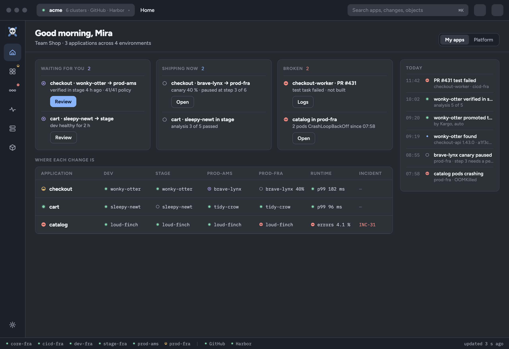
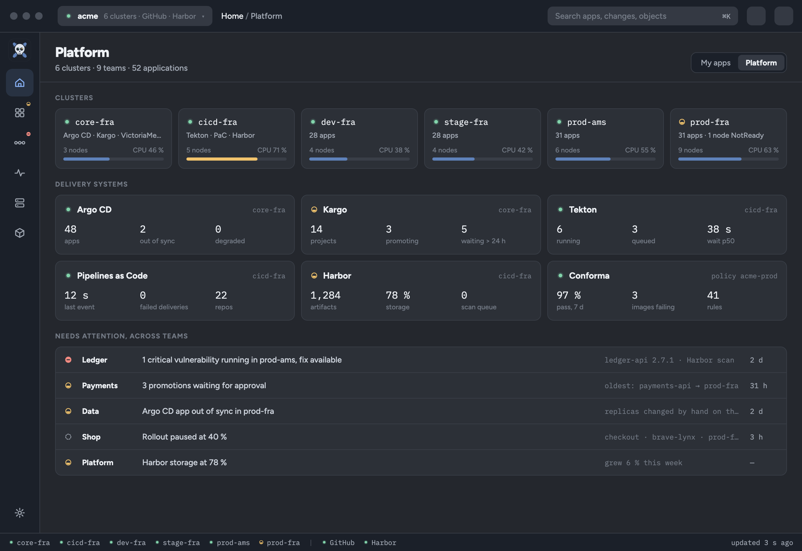
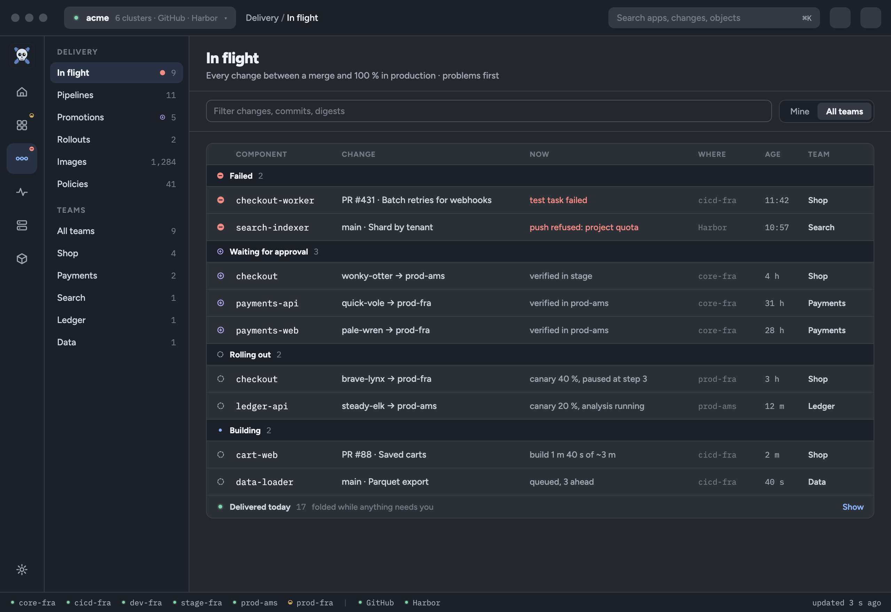
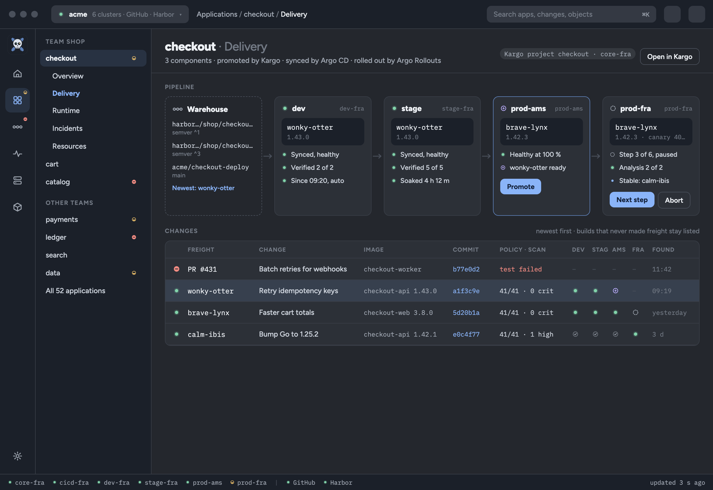
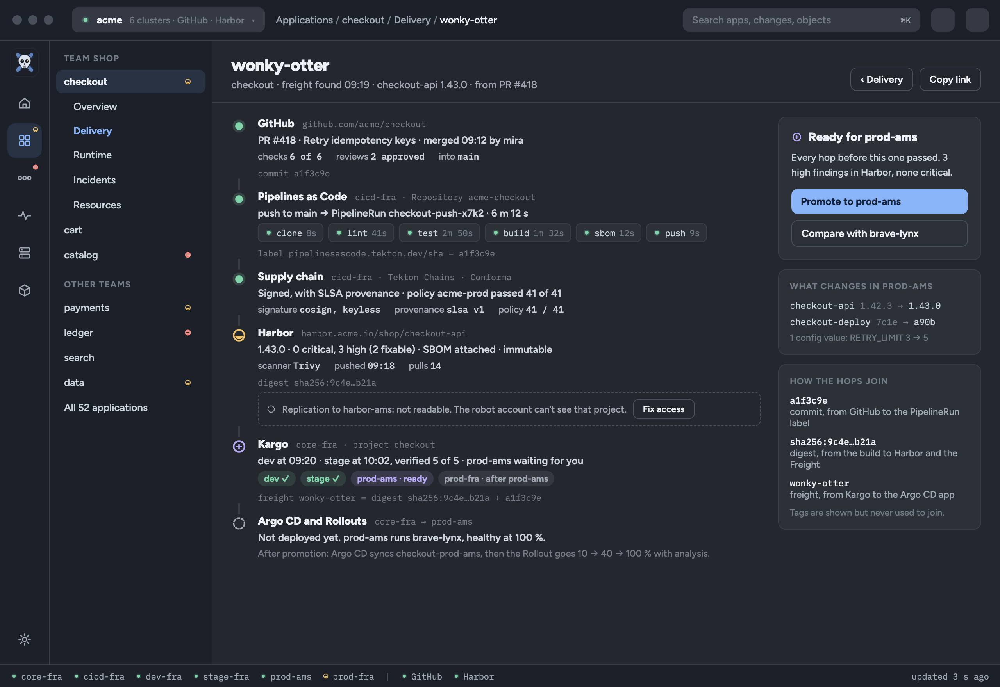
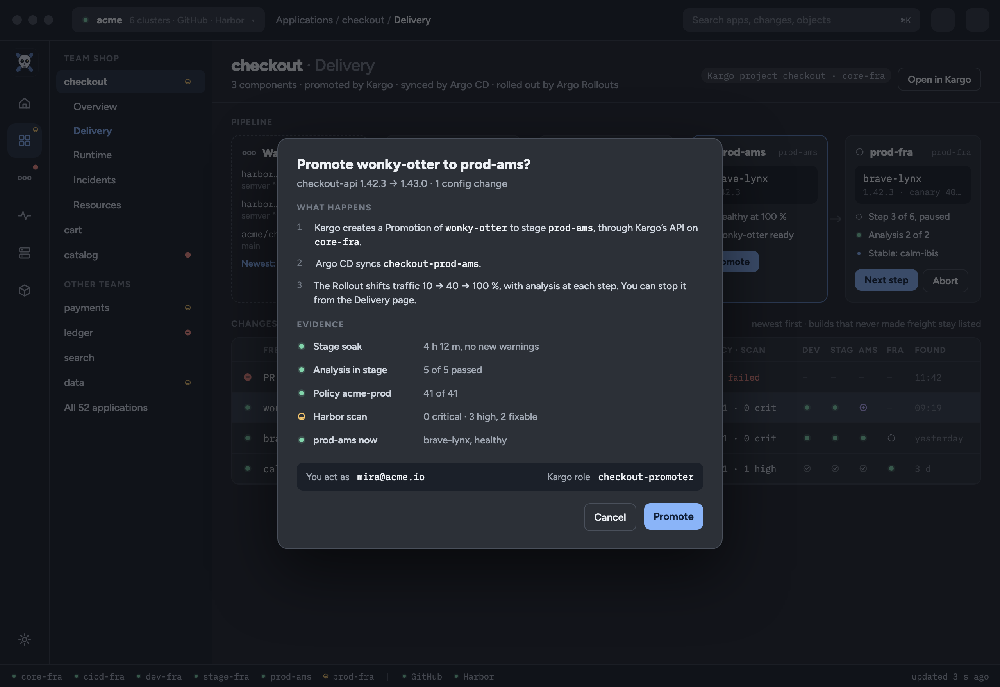
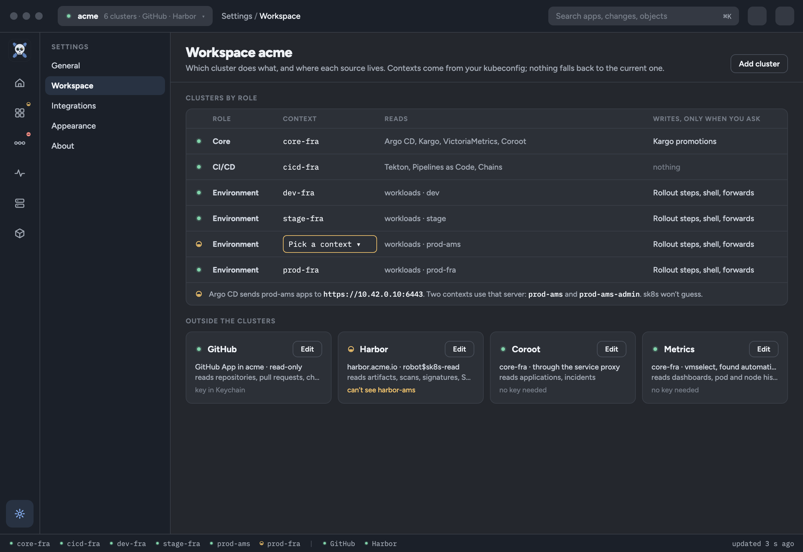

# Platform: commit to pod

Freshkube today is a cluster browser with Talos inside it. This file proposes a different front door: a platform-engineering tool for teams that run on Kubernetes, which follows a change from the commit to the pods that run it, across every cluster the delivery passes through. Browsing Kubernetes objects stays, as the layer every link lands on, but it is no longer the first thing the app shows.

It records the direction taken with the user, the stack it was shaped on, the screens, the model behind them and an order of work. Nothing here is built. The [roadmap](ROADMAP.md) decides when a step starts; the future ideas it extends are [F04](FUTURE_IDEAS.md#f04-explain-ownership-and-reconciliation) (ownership and Argo CD), [F06](FUTURE_IDEAS.md#f06-plan-changes-and-observe-their-outcomes) (reviewed changes and their outcomes) and [F10](FUTURE_IDEAS.md#f10-support-simultaneous-clusters-and-global-search) (simultaneous clusters). The writes follow the pattern of [pod exec](POD_EXEC.md) and [port forwarding](PORT_FORWARD.md). [#42](https://github.com/skel84/freshkube/issues/42) tracks the work; the spike is [#43](https://github.com/skel84/freshkube/issues/43) and the session registry [#44](https://github.com/skel84/freshkube/issues/44).

The mocks are static HTML pages with example data, in [`platform/`](platform/). Each screen below links its page. They show intent, not pixels: where a mock and this file differ, this file wins.

## Decisions

Taken with the user on 4 October 2026.

- **The product is about applications and changes, not resource kinds.** It answers "what is shipping, what is waiting for me, what broke, and why" across clusters. The Kubernetes browser becomes Explore, reached through ⌘K and through links from every other screen.
- **One chain, end to end.** GitHub → Tekton Pipelines as Code → Tekton pipelines → supply-chain checks (Tekton Chains, Conforma, Konflux where present) → Harbor → Kargo → Argo CD → Argo Rollouts → pods. All of it is in use at the user's work.
- **Clusters have roles.** A core cluster runs Argo CD, Kargo, VictoriaMetrics and Coroot. A CI/CD cluster runs Tekton and Harbor. Each environment has its own workload cluster. The app holds all of them at once.
- **Two starting points.** Platform engineers look across every team; developers look at their own apps. Home has both, one switch apart.
- **Approval early.** Promoting freight and stepping or aborting a rollout come with the first delivery slice, not after it. They are explicit actions behind a confirmation that shows what will happen, the evidence and who the user acts as.

## The stack, and where each piece is read

| Hop | Lives in | What we read | How |
| --- | --- | --- | --- |
| GitHub | github.com | Pull requests, commits, check runs, reviews | REST API, a GitHub App or fine-grained token, read-only |
| Pipelines as Code | CI/CD cluster | `Repository` and the PipelineRuns it started | Kubernetes API; PaC labels each PipelineRun with the repository, event, branch, pull request and SHA |
| Tekton | CI/CD cluster | `PipelineRun`, `TaskRun`, step pods and their logs | Kubernetes API; pruned runs need Tekton Results, if installed |
| Supply chain | CI/CD cluster, registry | Chains signatures and provenance, Conforma policy results | TaskRun annotations and results; Konflux `Snapshot` status where Konflux runs |
| Harbor | registry | Artifact by digest, scan summary, signature and SBOM accessories, immutability | Harbor API v2, a read-only robot account |
| Kargo | core cluster | `Project`, `Warehouse`, `Freight`, `Stage`, `Promotion`, verification | Kubernetes API |
| Argo CD | core cluster | `Application`, `ApplicationSet`, `AppProject`: sync, health, operation, destination | Kubernetes API, as F04 already plans |
| Argo Rollouts | environment clusters | `Rollout`, `AnalysisRun`: step, weight, pause and abort state | Kubernetes API |
| Pods | environment clusters | Running image digests (`imageID`), health | The existing summary and Resources reads |

Only GitHub and Harbor need credentials of their own. They follow the pattern of the remembered Coroot connection: entered explicitly, kept in the system's secret store, and never shown or logged. Everything else is read with the user's own kubeconfig identity, so each cluster's RBAC decides what appears.

## How the hops join

The whole design rests on joining records from different tools without guessing.

- **Two keys join everything: the commit SHA and the image digest.** GitHub and the PipelineRun share the SHA; the build, Harbor and Kargo's Freight share the digest; Freight names both. A pod's `imageID` closes the chain with what is actually running.
- **Tags are shown, never used to join.** A tag can move; a digest can't.
- **Each link has a confidence.** *Confirmed* when the digest or SHA matches on both sides. *Claimed* when only a label or annotation says so, such as a PipelineRun label without a matching digest downstream. *Unknown* when a side can't be read. The UI shows the difference, as F04 asks for ownership.
- **What runs is read from the pods, not from the plan.** A Stage that says it deployed freight X is a claim until the Rollout's pods report X's digest. This is "state over logs" applied to delivery.
- **A missing hop is not a failure.** A team without Harbor, or a robot account that can't see a project, shows that hop as "not connected" or "not readable", with the reason, never as broken and never as absent. An unreadable list is not an empty one.

## Information architecture

The rail is organised by what people are doing.

| Area | Holds |
| --- | --- |
| **Home** | My apps or Platform (below). |
| **Applications** | One page per application, with tabs Overview, Delivery, Runtime, Incidents and Resources. |
| **Delivery** | Every change in flight across applications, plus Pipelines, Promotions, Rollouts, Images and Policies. |
| **Observe** | Monitoring and Coroot together, the merge already planned. Sources belong to the workspace, not to one context (below). |
| **Infrastructure** | Nodes, the node pane and Control plane: today's Talos and node pages. |
| **Explore** | Today's Kubernetes browser: every kind, custom resources, Events, Namespaces. |

**What an application is** has to be decided once and shared by every screen. The proposal: a Kargo Project first, then an Argo CD Application or ApplicationSet, then the `app.kubernetes.io/part-of` label, with a manual override saved in the workspace. "My apps" are the applications of the user's teams; how teams are known is an open question.

## Screens

### Home, My apps

[HTML mock](platform/home-my-apps.html). Three cards: **Waiting for you** (promotions this user may approve), **Shipping now** (promotions and rollouts in progress) and **Broken** (failed builds and failing workloads, with the skull for containers that died). Below, where each application's newest change sits in each environment, and the application's runtime health from Coroot. On the right, today's events in order.

### Home, Platform

[HTML mock](platform/home-platform.html). The view for the platform team: one card per cluster with its role and load; the health of the delivery systems themselves (Argo CD sync, Kargo promotions, Tekton queue and wait, PaC webhook deliveries, Harbor storage and scan queue, Conforma pass rate); and what needs attention across teams, such as a critical vulnerability running in production or promotions waiting over a day.

### Delivery, in flight

[HTML mock](platform/delivery-in-flight.html). Every change between a merge and 100 % in production, grouped problems first: Failed, Waiting for approval, Rolling out, Building. Changes delivered today fold away while anything needs attention, as healthy pods do on the Pods page. The filter takes component names, commits and digests; Mine and All teams scope it.

### An application's Delivery tab

[HTML mock](platform/app-delivery.html). The Kargo pipeline as stage cards: the Warehouse and its subscriptions, then each Stage with its cluster, its current freight and version, Argo CD's sync and health, verification and soak. A Stage with newer verified freight upstream offers **Promote**; a paused canary offers **Next step** and **Abort**. Below, the changes table: freight newest first, with its PR, image, commit, policy and scan, and where it has reached. A build that failed before producing freight stays listed, so a broken PR doesn't vanish from the application.

### One change, start to finish

[HTML mock](platform/change-trail.html). A single change as a list of hops: the pull request, the PaC run with its tasks, signing and policy, the Harbor artifact, each Kargo stage, then Argo CD and the Rollout. Every hop names the cluster or service it was read from and the key that joins it to the next. One hop in the mock can't be read and says why, with a way to fix access. The side column says whether the change is ready for the next stage, what will change there and how the hops were joined.

A failed task's **Logs** opens the step container's log in the existing `LogView<PodLogs>`, on the CI/CD cluster. When the pods are gone, Tekton Results is the fallback where it runs.

### Promote

[HTML mock](platform/promote-dialog.html). The confirmation lists what will happen in order, the evidence for it (soak, analysis, policy, scan, the target's current state) and the identity and role the user acts as. Cancel is the default.

### Workspace

[HTML mock](platform/workspace.html). Settings › Workspace gives each cluster a role and a kubeconfig context, with what is read from it and what may be written. Sources outside the clusters (GitHub, Harbor, Coroot, metrics) sit below with their access and any limit. The mock shows the ambiguous case: Argo CD deploys to a server address that two contexts share, so the user picks one.

## Several clusters at once

None of the screens above work with one connection, and today the app holds one context at a time. This is F10's session registry, and it comes first.

- **A workspace is a named, saved set of clusters with roles**, in `workspace.json` beside the preferences, as `monitoring.json` is. Each entry names a context explicitly. Nothing falls back to the kubeconfig's current context, and a missing context is reported, not replaced.
- **Each cluster keeps its own access session**, built on `AccessIdentity`. Rows, links and actions carry the cluster they came from, so a same-named object in two clusters can't be confused, and a link opens the object in the cluster that holds it.
- **Environments are found from Argo CD.** An Application's destination server is matched against the servers in the kubeconfig contexts. One match is used; several, or none, ask the user. A destination given by cluster name refers to a cluster Secret, which the app doesn't read, so it is mapped by hand once.
- **Observe sources belong to the workspace.** VictoriaMetrics and Coroot in the core cluster describe workloads in the environment clusters. Monitoring today looks for Prometheus inside the context it shows; it needs to look in the workspace's core cluster too.
- **Reads stay bounded and visible.** Hidden pages still contact nothing. Home and the rail's problem marks need a small background observation in each cluster, like today's Kubernetes summary: Stages and Freight in core, recent PipelineRuns by label in CI/CD, Rollouts in each environment. Each is a compact reflector with its own budget, coalesced as the summary is, and its coverage shows when a cluster can't be reached. A cluster that doesn't answer is not a cluster with no changes.

## Writes

Approval early means a third exception to read-only, after pod exec and port forwarding. The same rules apply: an action starts only from an explicit button, the confirmation names the object, the cluster and the identity, and the app watches the outcome rather than trusting the request.

- **Promote** creates a Kargo Promotion of the chosen freight to the chosen Stage, in the core cluster. Kargo authorises promotion with its own `promote` permission on the Stage; whether the app creates the `Promotion` through the Kubernetes API or calls Kargo's API server, as its CLI does, is the spike's first question.
- **Next step** and **Abort** act on an Argo Rollout in an environment cluster, as the `kubectl argo rollouts` plugin does. Which fields and subresources the plugin patches for each is checked against its source before building.
- **Outcome, not acceptance.** After Promote, the Delivery tab follows the Promotion, the Argo CD sync and the Rollout until the pods run the new digest, or until one of them fails, is aborted or stops being readable. An accepted request is shown as accepted, not as done.
- **Identity.** Requests use the user's own credentials for that cluster. The confirmation shows the user and, where Kargo reports it, the role that grants the action. A request the cluster refuses shows the refusal; the button is not hidden ahead of time on a guess about RBAC.
- **Naming.** Kargo promotes freight; Rollouts "promote" a canary step. The UI says Promote for Kargo and Next step for Rollouts, so the two never share a word.
- AGENTS.md's cluster-safety section and the roadmap's ground rules gain these exceptions in the commit that builds them. Live checks promote and step only on an application and environment the user names as disposable.

These are bounded operations with their own preconditions, not F06's general change plans. They should still use F06's vocabulary for accepted, verified, reversed and unknown outcomes, so a later plan workflow can absorb them.

## Readiness

Checked against main `a1b6b24` on 4 October 2026. The careful-reading groundwork carries over; holding one cluster at a time does not.

What carries over:

- **Identity and stale answers.** `AccessIdentity`, `ConfigurationRevision` and request generations already drop a late answer for an old target ([ACCESS_IDENTITY.md](ACCESS_IDENTITY.md)). Joining by digest across clusters needs the same discipline.
- **Watch-backed observation.** The Kubernetes summary session keeps compact reflectors with object and byte limits, coalesces changes and keeps refused, stale and failed apart. Delivery observation in each cluster is the same job.
- **Writes.** Exec and forwarding start only from an explicit action; Operations adds a single mutation slot, a confirmation tied to the exact target, and an audit trail.
- **Outside services.** The Coroot provider (bounded HTTP, explicit credentials, fake-server tests) is the template for Harbor and GitHub.
- **Logs.** `LogView<PodLogs>` streams any container, and a Tekton step is a container.

What is missing:

1. **One connection.** `Pilot` holds one access, one kubeconfig selection and one summary session; the Resources page holds one `KubeSource`; `open_object` assumes one cluster. Per-cluster state (access, summary, Kubernetes source, Talos target) moves into a session a registry owns. This is the largest change and comes first.
2. **Talos first.** The Kubernetes client often comes from Talos, Talos sets the 15 s cycle, and Kubernetes-only is a mode. In a workspace, Talos becomes an optional cluster role.
3. **Typed custom resources.** Resources shows server-printed tables, and `DynamicObject` appears only in forwarding. Kargo, Rollouts and Tekton need real fields, read by core structs per CRD version that tolerate missing fields.
4. **Credentials outside the clusters.** Coroot's are memory-only on main; GitHub and Harbor need keychain storage settled first.
5. **Cost.** [#22](https://github.com/skel84/freshkube/issues/22) (main-thread burst cost) is open, and six clusters multiply the summary sessions. Measure with `scripts/stress.sh` before and after the registry, and give each cluster a watch budget.
6. **Navigation.** `Page` and `Area` describe one cluster's pages. An application with tabs across clusters needs another routing level, and links carry the cluster.

Before step 1, a read-only spike ([#43](https://github.com/skel84/freshkube/issues/43)) against the real core and CI/CD clusters joins Freight, Stages, Argo CD Applications, Rollouts, PipelineRuns and pod digests in core, with no UI. It records the CRD versions, the RBAC the user's identity gets, how promotion and rollout steps are requested, and the answers to the open questions below. Screens beyond these mocks wait for it.

## Order of work

Each step ships with example data in `--fixture` (the acme workspace in the mocks), a `FRESHKUBE_PAGE` slug for captures, UI tests for loading, empty, refused and failed states, and no live writes during verification.

1. **Workspace and simultaneous sessions** ([#44](https://github.com/skel84/freshkube/issues/44)). The workspace file and Settings page, one access session per cluster, cluster-qualified identities and links, and the Argo CD destination mapping. Today's single-context mode remains a workspace of one.
2. **Applications.** The application model (Kargo Project, Argo CD Application, `part-of`, override) and the Applications area, with Resources reached for each application's objects in the right cluster.
3. **Delivery, read-only.** Kargo Warehouse, Stages, Freight and verification, Argo CD sync and health, Rollout steps, and running digests from pods. The application's Delivery tab and the change page from Freight onwards.
4. **Promote, Next step, Abort.** The confirmation, the requests and the followed outcome. This is the first write outside exec and forwarding, so it gets its own design pass in this file before building.
5. **Builds.** PaC Repositories and PipelineRuns by SHA, task status and step logs from the CI/CD cluster; failed builds in the changes table.
6. **Supply chain and Harbor.** Chains and Conforma results, then Harbor artifacts, scans and accessories through a robot account.
7. **GitHub.** Pull requests, checks and reviews for the commits already joined.
8. **Home and Delivery in flight.** My apps, Platform and the cross-application list, with their background observation and budgets. They come last because they summarise what steps 3–7 read.

Steps 5–7 can move in any order once step 3 lands. Explore, Infrastructure and Observe keep today's pages throughout; the rail changes with step 2.

## Open questions

- **Teams.** How does the app know which applications are "mine": Kargo Project RBAC, GitHub team membership, a label, or a list the user keeps?
- **Konflux.** Is Konflux running in full, with Applications, Components, Snapshots and Releases, or are Tekton, Chains and Conforma used on their own? The supply-chain hop reads different objects in each case.
- **Tekton Results.** Is it installed? Without it, a pruned PipelineRun's logs are gone, and the change page should say so.
- **Approve or promote.** Kargo separates approving freight for a Stage from promoting it. Is the user's prod gated by manual approval, by manual promotion, or both?
- **Argo CD diffs.** F04 links out to Argo CD's UI for diffs. Is that enough, or does the change page need a native desired-against-live diff?
- **Harbor replication.** Production may pull from a replicated registry. Is the digest the same there, and can the robot account read both?
- **The name and the site.** The sk8s.app headline ("Your cluster, problems first") describes today's product. It waits for this direction to settle.
