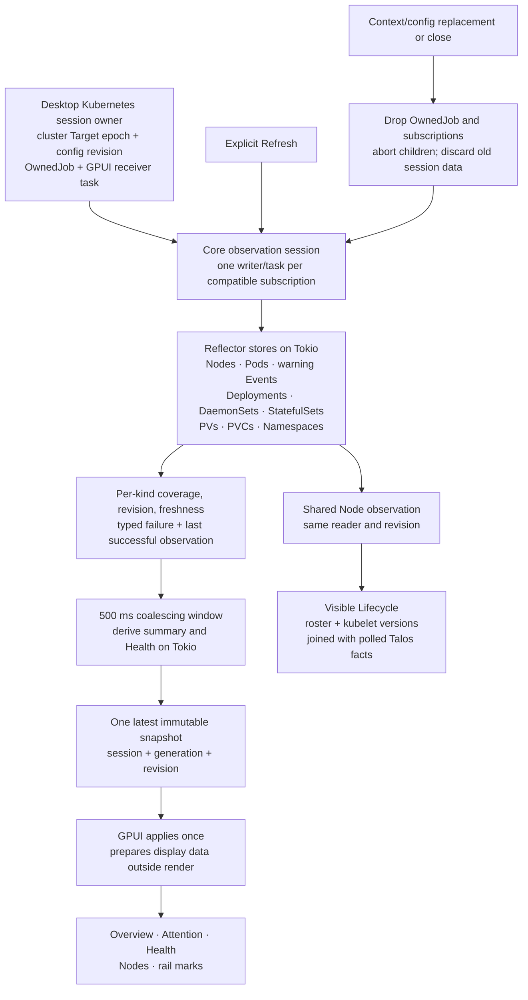

# Roadmap

What has landed, what comes next and in what order. Update this file in the same commit as the work it describes: move a step to Done with its commit, and keep open checks honest.

## Ground rules

These hold for every step until a later one deliberately changes them.

- **Read-only Kubernetes.** The app lists, watches, gets and streams logs. Changing the cluster waits for a reviewed change workflow ([F06](FUTURE_IDEAS.md#f06-plan-changes-and-observe-their-outcomes)). Talos node operations stay on the Operations page behind their own preflight and confirmation. There are two exceptions, and each starts only from an explicit action. Pod exec creates a `pods/exec`: a shell starts only from Start on a chosen pod and container ([POD_EXEC.md](POD_EXEC.md#decisions)). Port forwarding creates a `pods/portforward`: a forward starts only from Forward on a chosen port. It changes no objects, but it reaches whatever that port serves, admin endpoints included ([PORT_FORWARD.md](PORT_FORWARD.md#decisions)).
- **The chosen context only.** Connect to the context the user named, or the one the kubeconfig marks as current. When a named context is missing, report it; never swap in another.
- **Identity, not position.** Rows and documents are identified by connection, resource, namespace, name and UID. A response for another selection or object incarnation is dropped.
- **Honest states.** Loading, loaded, refused, failed and stale are distinct. An unreadable collection is never shown as empty, and failed refreshes keep the previous data marked stale.
- **Source reuse.** Code taken from Kubeli (MIT) keeps its notice and is recorded in a NOTICE file. Rubick is studied for behavior, not copied. See [the reuse policy](REFERENCES.md#reuse-policy).

## Done

| Step | What landed | Commit |
| --- | --- | --- |
| Cluster source seam ([#53](https://github.com/skel84/freshkube/issues/53), [#356](https://github.com/skel84/freshkube/issues/356)) | Monitoring and Observability no longer import `crate::resources`. Core's `cluster_source` holds `ClusterSource { id, context, access }` and `ClusterAccess { Example, Live(Arc<dyn KubeClientSource>) }`; desktop's `KubeSource::cluster()` wraps a clone of the existing `KubeAccess`, so its client caching is unchanged, and Observability takes the connection id alone. No behaviour change: desktop's 917 tests pass unchanged apart from the monitoring page tests' source, which is now a `ClusterSource` with a client stub, and core adds two tests (1790 → 1792 in the workspace). | the commit that adds this row |
| Coroot severity colours ([#226](https://github.com/skel84/freshkube/issues/226), item 2) | A Coroot chart of log severities, the Logs report's histogram and a pattern's chart (`ChartPanel::severities`), draws each severity in the Console colour nearest the one Coroot names (`SeriesColor::severity`): fatal and error critical, warning amber, info blue, debug green, trace and unknown grey. `PanelView::set_named_colors` hands them to the derive, which draws a named series in its colour, focused or not; a series with no colour or an unknown one keeps its turn. Other Coroot charts keep their turn, since there Coroot's colours are categorical, and Prometheus dashboards still ignore theirs | the commit that adds this row |
| Pods row Logs ([#291](https://github.com/skel84/freshkube/issues/291), part 3 of 3) | Every pod row has a Logs button after its name (`resources/screen/cells.rs`), pinned with the glyph and name so it stays in reach as the table scrolls sideways and clear of the drawer; muted until hovered or selected, id `pod-row-logs-<uid>` and labelled "Logs for ⟨pod⟩", derived with the row. It emits the same `ResourceLink::Logs` as L (`open_logs_of`), without selecting the row or opening the drawer. The column has no header, doesn't sort and isn't in the Columns menu. Only an init container restarted Always is a sidecar | the commit that adds this row |
| Pods Containers ([#291](https://github.com/skel84/freshkube/issues/291), part 2 of 3) | Pods gain a Containers column after Name: a square per container from `freshkube_ui::squares`, init containers first and dimmed, derived with the row (`resources/rows.rs`) from core's `RunState` for app and init containers. The square's colour follows DESIGN.md's table (G7); the tooltip and accessible label name each container's state, reason and restarts, and the column sorts the worst square first. A workbench story shows each state. Group rows drop a part too narrow for a letter rather than leave a sliver. The row Logs button follows | the commit that adds this row |
| Pods Restarts and order ([#291](https://github.com/skel84/freshkube/issues/291), part 1 of 3; [#321](https://github.com/skel84/freshkube/issues/321)) | Pods' columns follow Freelens's order: Name, Ready, CPU, Memory, Restarts, Owner, Node, Age (`resources/screen/layout.rs`). Restarts leaves Ready for a sortable column of its own, and Ready narrows to `0/1` and sorts the least ready first. A group row's buttons follow its count (`GroupRow::after` takes the rest), so they stay clear of the drawer, and the Healthy row offers Collapse only while healthy pods can fold. Containers and the row Logs button follow. | the commit that adds this row |
| Log Download ([#301](https://github.com/skel84/freshkube/issues/301), part 2 of 2) | Every log's toolbar ends with Download (`freshkube-logs`'s `download.rs`), in the dock and the node pane: a menu of Visible lines (N) and All retained lines (N), counted when it opens. The file's text is what Copy copies of the same lines, with or without each line's time as the list shows it; the name is the source's `download_name` (`ns-pod[-container][-previous]`, `ns-workload[-pod]`, `node-service`) and the time, suggested in ~/Downloads, else home. The save dialog is the platform's; the write runs off the UI thread to a temporary file renamed into place, so a failed save leaves nothing, and the toolbar's note says where it saved or why it couldn't. An icon-only menu button (Levels, Download) keeps its caret beside the icon instead of clipping it; to keep two rows at 760 points and text size 20, a compact pod toolbar's status tag is its glyph alone, its words in the tooltip and label | the commit that adds this row |
| Workload Pod select and Timestamps ([#301](https://github.com/skel84/freshkube/issues/301), part 1 of 2) | A workload tab's toolbar row starts with its own tools (`LogSource::tools`): a Pod select, All pods or one pod newest first, and the pod tab's Timestamps toggle. The Pod select is a filter: it narrows the lines and the container chips to that pod while every stream reads on, so All pods shows the rest again at once. A picked pod that leaves keeps its pick, marked "(gone)", with what it wrote; a pod the 20-stream cap leaves unread is marked "not read", and the menu and the empty list give the cap note's words | the commit that adds this row |
| Details \| YAML ([#290](https://github.com/skel84/freshkube/issues/290), part 2) | The drawer's five tabs become two (`resources/pane/`). Details is one scrolling page: the Overview with a pod's cause card first, Ports for a pod, Service or workload, then Events, under an index (`Section`) whose buttons jump to a section and mark the one at the top. A section asked for (Forward, All events, `set_tab(Tab::Events)`) scrolls there and stays marked until the user scrolls; YAML and back keep the place. `Tab` still names destinations for links. A copy button beside the title copies the name. The node pane keeps its own tabs | the commit that adds this row |
| Details drawer ([#290](https://github.com/skel84/freshkube/issues/290), part 1) | Resources' detail pane leaves the split for a drawer over the list's right edge, under the page toolbar (`freshkube_ui::drawer`). It opens 725 dp wide and keeps within 300 dp and the least of 90% of the list's measured width and that width less 280 dp; under 600 dp it takes the whole list. Its left edge resizes it, saved under `drawer` in `navigation.json`, one width for every kind. Another row swaps it; a click beside the rows, L, Logs, Previous and Shell close it and keep the row selected; × and Escape close it and clear the selection. A short page keeps only the list's 180 dp, since the drawer scrolls itself. A workbench story and `layout_check::assert_drawer`. The Nodes inspector stays ([#308](https://github.com/skel84/freshkube/issues/308)); Details \| YAML follows | the commit that adds this row |
| Log dock ([#284](https://github.com/skel84/freshkube/issues/284), part 1 of 3) | Logs leave the detail pane for a full-width dock of tabs under the page, on every page (`freshkube_ui::dock`, `desktop/dock/`). Every logs action emits `ResourceLink::Logs`; a tab per (connection, kind, namespace, name, and a pod's UID), at most eight, each with its `LogView` and a feed that watches its pod by name or reads its workload's selector, reads while open whatever the page shows, and is dropped on close, another context or a lost connection. Minimize, Fit to window, a dragged height that minimizes below 100 dp, × that closes every tab, middle-click that closes one; the page keeps 100 dp and the dock the log's toolbar and three lines. Control-. / Control-, switch tabs, Command-W closes one. Height, state and tabs are saved in `navigation.json` and restore unstarted for their context. Eight tabs at 1,000 lines/s each measured in [PERFORMANCE.md](PERFORMANCE.md#eight-dock-tabs-284-7-october-2026). Shell tabs and the toolbar additions follow | `f6e3081` |
| Log toolbar ([#284](https://github.com/skel84/freshkube/issues/284), part 2 of 3) | Every log view, in the dock and the node pane, puts its controls in one row: the source's tools (`LogSource::tools`: a pod's container, tail, Previous, Timestamps, Stop or Resume and status) before Levels, a menu with each level's count, search, Wrap, Follow and Copy. Under 40 rem the buttons show their icons alone, except Previous, and the row wraps to at most two. A source's note (`LogSource::notes`) sits under the row on one line, with its whole text in the tooltip; a crash loop's ends "Previous shows the last run". The pane has one Logs button, which opens the container at fault, else the default. A pod tab asked for by name keeps the first pod it finds. Shell tabs follow | `fdbcd28` |
| Shell tabs ([#284](https://github.com/skel84/freshkube/issues/284), part 3 of 3) | Shells leave the pane's Shell tab for dock tabs (`resources/shell/`, `desktop/dock/`): the pane's header has a Shell menu, "Start shell in ⟨container⟩" per container, enabled for running ones, and the pick is the explicit Start (`ResourceLink::Shell`). A tab per pod and container, "Shell ⟨pod⟩", whose session runs whatever page or object shows, so navigating never asks and the pane has no pin. Closing a running shell's tab, from any path, asks "End the shell in ⟨pod⟩?" or "End 2 shells?" (`unless_shell`), as do another context and quitting (`may_close`); a closed tab ends its session politely. Shell tabs are saved with their container and come back idle. At most eight shell tabs, apart from the eight log tabs: a ninth takes the place of the oldest that runs nothing, or asks to end the oldest's shell when every one runs, and a restore keeps the first eight. The status bar reads "2 logs · 1 shell". A focused terminal keeps every Control key, Control-. and Control-, included. The compact Levels button keeps its chevron, and a crash loop's note starts with "Previous shows the last run", its tooltip wrapping at 360 dp. | the commit that adds this row |
| Workload logs ([#275](https://github.com/skel84/freshkube/issues/275), step 7) | A Logs tab on every kind that runs pods follows the workload's pods in one `LogView<WorkloadLogs>` (`logs/workload/`): core's `follow_workload_pods` watches the selector, each app container streams through `follow_pod_log`, and lines merge by time across the retained buffer, so a lagging stream's lines take their place without moving a paused review or the selection. Tags are `pod/container`, shown without the prefix every pod shares; pods joining and leaving are marked; at most `MAX_STREAMS` (20) containers, the newest pods first, with a notice. Reads only while the tab has shown and the page shows; showing again reads on from each container's last line. `FRESHKUBE_PAGE=workload-logs` opens it in fixture mode | `1d6a373` ([PR #280](https://github.com/skel84/freshkube/pull/280)) |
| Chart bars and ticks ([#226](https://github.com/skel84/freshkube/issues/226), items 1 and 3) | Bars that stack together share their column's whole width instead of a slice per series, and an axis of whole values, as counts are, takes whole ticks. The plot's line and area groups and its bar places are derived once per answer, and `paint_series` is split into bars, groups and dots. Item 2 (Coroot's series colours) stays open with its owner | the commit that adds this row |
| Monitoring on the shared look ([#46](https://github.com/skel84/freshkube/issues/46), step 4.5) | Compared with Pods side by side. The variables and the Annotations toggles become `PageHeader`'s secondary row, above the meta line: outline buttons 24 high, a variable's name muted before its value, a toggle on taking `ui::choice`'s primary outline. Auto-refresh reads "Auto-refresh off" or its interval after a good glyph. A table inside a card (`DataTable::inset`, and the footer of a carded or inset table) rounds its bottom corners to the card's, which its square fill covered (Firing alerts, the Application report's traces). The earlier parts are in [#62](https://github.com/skel84/freshkube/issues/62): cards, header, breadcrumb, frame and table panels | the commit that adds this row |
| Chart series cap ([#22](https://github.com/skel84/freshkube/issues/22)) | A crowded timeseries draws its 30 highest-peaking series, with "Show all" (`monitoring/derive/cap.rs`). Panels whose query already uses `topk`/`bottomk`, and stacked panels, are never capped ([MONITORING.md](MONITORING.md)) | `2151c07` ([PR #245](https://github.com/skel84/freshkube/pull/245)) |
| Linux and Windows releases 3. Releases and first-run reports (step 2) | A `v*` tag's draft also takes the Linux and Windows builds of the tagged commit from `packages.yml`: only a platform whose package and first-frame jobs passed, whose archive matches its `.sha256` and whose manifest matches the tag (`scripts/release-manifest.py`, shared with macOS). Each build is downloaded apart and moved into the draft's files only once every check has passed. While preview, a missing or failed build, or an error from GitHub's API, leaves that platform out with a warning at the top of the notes, and macOS goes ahead; the notes add a preview install section for each build included. [FIRST_RUN.md](FIRST_RUN.md) holds the tester's checklist (start, fixture, one real context read-only, logs, a shell, a remembered key, scaling, terminal output) and the record that turns a platform supported. Checked with a fake `gh` against a pull request run's real artifacts: all present, no run, a failed job, an expired artifact, a corrupt archive, a CRLF checksum, a download that fails partway, and a failed API call for the run and for its jobs. Replayed with the real `gh` against `main`'s first packages run (`f0a9748`, 0.6.0): both builds verified and attached; and against 0.6.0's tagged commit (`82bb938`), which has no packages run: macOS only, with the warning | the commit that adds this row |
| Linux and Windows releases 2. Packages and first frame (step 2) | `packages.yml`, apart from CI so a failure never holds back macOS, packages every push to `main` (and by hand on a branch) with `scripts/package-portable.py`: a reproducible Linux tarball built on Ubuntu 22.04 (glibc 2.35 floor, linked libraries checked against `linux-runtime-packages.txt`) and a Windows zip with a static C runtime and a GUI-subsystem executable that attaches to a parent terminal's console. Each has a `.sha256` and a manifest, kept 90 days. Machines that didn't build them start the extracted archive with `--fixture` (Linux in a bare `ubuntu:22.04` container with only the runtime packages, Xvfb and Mesa's software rendering; Windows on WARP) and wait for `first frame: window` ([PACKAGING.md](PACKAGING.md)) | the commit that adds this row |
| Linux and Windows releases 1. Window first frame (step 2) | `FRESHKUBE_FIRST_FRAME=1` prints `first frame: window after N ms` when the shell first draws, whatever page opens and in release builds too, so a release smoke check can see a packaged binary draw. `freshkube-probe`'s `first_frame` timer is compiled into every build; it stays silent without the variable, costing one atomic load per shell render. The Pods mark stays debug-only | the commit that adds this row |
| G6 glyphs and the skull ([#46](https://github.com/skel84/freshkube/issues/46), step 6.13) | `ui::status_glyph` draws the G6 Round set instead of the dot, triangle and diamond: a dot in a halo, a half-filled ring, a disc with a bar cut out, a dashed ring, a ring with a plus and, for information such as log errors, a small blue dot (`Tone::Info`), 10 dp at every text size, from compiled-in SVGs painted as alpha masks. A new `Tone::Died` draws a skull in the critical colour; Pods give it to a container that ran and stopped (`CrashLoopBackOff`, `Error`, `OOMKilled`, in an init container too) and so does a pod's cause card, while one that can't start keeps the critical disc. Died pods count and group as failing. `status_mark` is an image named by its tooltip. Unit tests rasterise every drawing; UI tests check the marks' size and labels at 13 and 20 px and Pods' mapping and counts | the commit that adds this row |
| The skull on Health and Overview ([#103](https://github.com/skel84/freshkube/issues/103)) | Core's `PodIssue::died` names a container that ran and stopped (`CrashLoopBackOff`, `OOMKilled`, `Error`). Health's pod rows and their detail title draw the skull for it, and Overview's Needs attention, and the node pane's rows from it, draw the skull and file it under Failing. A pod that can't pull its image stays critical; Health's pending pods keep the dashed ring. Tests check core's rule, its agreement with Pods' `rows::died`, the attention group and counts, and Health's example rows | the commit that adds this row |
| Pinned cells take their own clicks ([#95](https://github.com/skel84/freshkube/issues/95)) | While a table's pinned run pins, the cells passing under it are clipped at its right edge (`Passing`), so only the row and the pinned cells take hover, clicks and tooltips there; a pinned Name header sorts once. The table builds pinned only when the run pins, so an unscrolled table builds as before, and `Watch` on the scrolled header draws again when a frame's scroll disagrees | `bad4cca` |
| Observability Incidents ([#60](https://github.com/skel84/freshkube/issues/60), part 1) | The page answers `TableSource` through a page-local dispatch (`observability/tables.rs`), so Applications and Incidents share one entity's table. Example incidents are `api::Incident`/`IncidentView` values prepared by the live code, and the hand-drawn example page is gone. Incidents draws Pods' `PageHeader` (filter, Open/Resolved status chips, density, Columns, time range) and a fitted `DataTable` selected by key and application, with a Showing bar in place of the pager. The detail pane sits beside the table at 900 content width or more (460, minimum 320, 14 gap) and below it otherwise; it is fixed-size until change 9's Inspector. Local times; Duration and Impact hidden by default; filters survive a connection reset. `assert_page_frame` and `assert_table` at 13 and 20 px. Traces is part 2. | `14f455e`, `1ee0609`, `d17e9f9`, `74d3029`, the commit that adds this row ([PR #104](https://github.com/skel84/freshkube/pull/104)) |
| Observability Traces ([#60](https://github.com/skel84/freshkube/issues/60), part 2) | Example tracing is `api::Tracing` from `example::tracing`, prepared by the live code, and the hand-drawn example page is gone. `live_traces.rs` became `traces/` (`mod.rs`, `heat.rs`, `waterfall.rs`, `table.rs`). Traces draws Pods' `PageHeader` (filter, sources, All/Failed requests, Columns, time range; no density) and a fitted `DataTable` keyed by trace and span id, through the page-local `tables.rs` dispatch. The trace is a detail pane beside the table at 900 content width or more and below it otherwise, through `view::split`, which Incidents now shares. Local times on rows and the heatmap axis. Captions are measured as `ui::column_label` draws them; text cells end in an ellipsis; incident titles use the interface face; Coroot's information status uses `Tone::Info`. Heatmap arrow keys are [#105](https://github.com/skel84/freshkube/issues/105). | `e980762`, `7f18477`, `0877603`, `a44d218`, `e0a5ba1`, `fac15b0`, `a991e91`, the commit that adds this row ([PR #112](https://github.com/skel84/freshkube/pull/112)) |
| Desktop grade 1. Sentence-case column headers ([#97](https://github.com/skel84/freshkube/pull/97)) | `ui::column_label` (11.5 semibold muted, the label as given) draws every `DataTable` header cell, pinned or not, instead of the uppercase `ui::caption`, which stays for section and field labels. Pages already give their labels in sentence case; Kubernetes' printed columns keep their own. Widths and `layout_check` are unchanged | `ce55dd2` |
| Desktop grade 2. A 26 header row | `HEADER_HEIGHT` 30 → 26, still on `surface_2` with a bottom hairline; `layout_check` measures 26 on every table page (Resources, System services, Applications, Nodes) | `79cbcc3` |
| Desktop grade 3. One 26 row height | `ROW_HEIGHT` 34 → 26 for every table and group row, cells padded 10; the Density control goes from Pods, System services, Nodes, Applications and Incidents, with `TableState::compact`, `row_height()`, `COMPACT_ROW_HEIGHT` and `layout_check::Density`; `layout_check` measures 26 rows on every table page | `d6043d6` |
| Desktop grade 4. No card around the table | `data_table` draws the table bare: on its pane's background with a hairline above and below, no radius or side borders; `.carded()` replaces `.bare()`. Pinned cells paint the table's own fill. Resources, System services, Nodes and Applications go bare, and `layout_check::assert_bare` fails a table page whose table sits in a card. **Incidents and Traces stay `.carded()` until change 9's inspector replaces their detail cards.** | `0fbd556` |
| Desktop grade 5. A page frame without margins | `page::page` drops its 26 / 22 / 18 padding and 14 gaps: the header, banners and panes stack edge to edge, and `page::inset()` pads what isn't a pane 12 × 10. Resources, Nodes, System services and Applications run their table to the window's edge; the detail pane's card is inset 12 on its outer edges until change 9. Overview and Observability's other destinations keep the old frame as `page::padded`. `layout_check::assert_edge_frame` measures it on every table page. **`screens::content_width` still subtracts 2 × 26, so no breakpoint moved; change 6 retunes it with `HEADER_NARROW`.** | `5196644` |
| Desktop grade 6a and 12. The header as a toolbar | `PageHeader` draws 38 rows: the title is the first row's label, 13 semibold in `ink`, and every control is 24 (`ui::CONTROL_HEIGHT`); a `.secondary` row is a second 38 row. Table pages put it in `page::toolbar`, 12 in, with a hairline under it; pages of cards take the label without one. Every Resources kind draws Pods' header. Edge pages compare breakpoints with the page's own width (`screens::page_width`, `inset_width`), and `HEADER_NARROW` 920 → 880 follows Pods' one-row toolbar. `layout_check::assert_toolbar` measures the row, the label and the controls on every page it checks. A narrow header draws no empty rows, the meta line wraps between whole parts, and etcd's quorum detail wraps. The overflow menu is 6b | `ff2db81`, `9bf2cdd`, `35ebc8c` |
| Desktop grade 6b. The toolbar's overflow menu | `PageHeader`'s row never wraps: controls added with `.foldable(control, items)` fold into a 24 `…` menu, the rightmost first, from the widths the header measured; when the title, filter and `…` leave no room for the chips, they take a row of their own. Each control's menu form shares its handler (`page::handler`, `item`, `submenu`). `HEADER_NARROW`, the `narrow` parameter and `render_fit` are gone. Pods at 760×560/20 has one toolbar row and the chips' row, down from three rows | `5fbc5a7` |
| Desktop grade 6c. Folded controls keep their values | A folded picker names its value in the `…` menu (`page::submenu_value`: `Namespace · payments ›`, cut at 24 characters), and Columns its count (`page::columns_fold`). While a folded control is off its default (`page::Fold::changed`), `…` carries an accent `badge_dot` and its tooltip and accessibility label list the changes. Resources, Applications, System services, Nodes, Incidents and Traces; Project shows its value without a dot, Refresh never adds one | `d670f2e` |
| Desktop grade 7. The meta line in the status bar | Resources, System services, Nodes and Observability no longer draw a meta line under their header: each derives a `freshkube_ui::status::Segment` when its data changes, and the shell draws the visible page's after its own status, behind a hairline. The segment leaves out a context the shell already names, tones stale and failed parts, and truncates with the whole line in its tooltip; it sits in the bar's centre, so the right side keeps its width. Below 1080 the shell's status shrinks to its glyph beside a segment. Pods at 1280/13 has one 38 toolbar row; the node pane's Pods list keeps its line | `0efb862`, `3302676` |
| Desktop grade 8. Counts in the table's footer | `TableSource::notes()` becomes `counts()` and `footer()` becomes `legend()`; the table draws one 26 footer row under its rows when there is either, the counts first at their width (`table::selection`, `table::showing`, ids unchanged), then the legend, which truncates. The blue strips above the rows go from Pods, Applications, Incidents, Traces and Monitoring's table panels, so the header sits under the toolbar; Nodes' legend takes the same row. Overview's Attention keeps `showing_bar` until it migrates. `layout_check` measures the footer and that it sits under the rows | `9a6262e` |
| Desktop grade 9a. The inspector | `freshkube_ui::inspector`: `Inspector` is the selection's pane without a card, a heading padded 12 and a body that scrolls on its own; `inspector::split` puts it beside a bare table, resizable on Kit's hairline (460 dp to start, 320 least each side), or under it below 900 page width (190 and 380, least 96 and 220). `InspectorSplit` keeps the width in dp and reports a drag once, on release; desktop saves it per page under `inspector` in `navigation.json`, one global shared with the sidebar's `collapsed`, and a file without it gives 460. Incidents and Traces move to the edge frame with their detail in it; Traces' heatmap sits in a band above the split, the Application report's Tracing block draws the split in one card, and a short window scrolls the frame around a split of `inspector::short_height`. `layout_check::assert_inspector` measures it. Resources is 9b, Nodes 9c | `8e18ed7` |
| Desktop grade 9b. Resources on the inspector | Resources' detail pane is `Inspector::new("detail-inspector")` in `inspector::split`, with no card: the heading, a `.banner` for its notice, a `.tabs` strip of `inspector::tab` (28 dp high, padded 10, a 2 px accent underline), a `.content` that lays out and scrolls itself, and a `.footer` for feedback. One width for every kind, saved under `resources`. The tabs' content is inset 12 like the heading. The split takes a page's stacked heights (`.stacked(Stacked { lead, trail })` of `Pane::new(start).least(n).most(n)`), a lead start given while rendering until the user drags it (`lead_start`), and `short_height` from its leasts. A short Resources page scrolls its frame at any width. The node pane keeps its card until 9c | `ffcbc9b` |
| Desktop grade 9c. Nodes on the inspector | The node pane is `Inspector::new("node-inspector")` in `inspector::split("nodes-split", …)`: the title, Ready tag, Expand and close as its heading, the chips as its banner, `inspector::tab`s with Logs' collecting dot, the Services mark and More, and each tab's body as its content. The table and its toolbar stay beside it (from the cards, the one-to-a-row roster), and the narrower table scrolls sideways with its glyph and name pinned; under 900 page width it stacks under the table at the default heights, with no Back. Expand fills the page with it. The width is saved under `nodes`. A short page scrolls its frame, and in a short window the Logs body scrolls inside the inspector, since Talos' toolbar can take most of it ([#233](https://github.com/skel84/freshkube/issues/233)). The node's Events and YAML lose their card. The node's screens (Services, Processes, Network, Storage, Diagnostics) lay out by the inspector's width, not the window's. The chips wrap rather than cut; the roster marks the opened node as the table marks its selected row; a stacked inspector reveals the opened row once the split has settled its heights; and Expand or Collapse in a short window scrolls the frame to keep the heading in view. The node's screens read the inspector's width as Kit last laid it out (`InspectorSplit::live_width`), so a window or text-size change doesn't leave them on the dragged width | `0ea4898` and the commit that adds this hash |
| Observability Applications ([#50](https://github.com/skel84/freshkube/issues/50)) | Shared `PageHeader` and scrolling page frame replace the caption and connection rows; source, project, local time picker and page Refresh sit in the header, while the frame's session Refresh remains for #46 step 5. Categories sit in the header's secondary row. A fitted `DataTable` uses namespace `GroupRow`s, density, Columns, a Showing bar with Pods' “Show all 28” and a legend; scrolled sideways, its group labels stay in view (#91). Its glyph and name are not pinned yet: the pinned overlay lets clicks through to the report buttons beneath. Application categories are selected by default with an all-category fallback, counts follow filters, report cells distinguish healthy, unknown and missing values, and app tooltips use names. Search everything keeps one width on every page. Applications' list and glyph allowlist entries are removed. Stress against `4edd965` within noise; Applications scroll FPS 14 → 13, not significant (p = 0.10). | `17a3a0e`, `1927c31`, `11cff97`, `6e2af6f`, `795f043`, `98531c1` ([PR #68](https://github.com/skel84/freshkube/pull/68)) |
| Nodes on the shared components ([#49](https://github.com/skel84/freshkube/issues/49)) | Nodes draws with Pods' `PageHeader`, status chips and `DataTable`: a text filter, source freshness, Failing, Warning, Unknown and Healthy groups with Healthy folded while anything is wrong, comfortable/compact rows, a Columns menu and 12 px cards, with the retained node pane, selection and keys unchanged. CPU and Memory use Pods' bullet meters: the band is the requests of the node's non-terminated pods (core's `PodRequests` rules), the line is metrics.k8s.io use, read every 15 s only while the page shows, and the end is Node allocatable, never Talos's physical total. A failed read or a NotReady node keeps the last answer striped; without metrics, memory falls back to Talos's used memory and CPU says why it is unknown. Load is an optional column and sits in the CPU tooltip. The stress server answers node metrics. Stress against `4edd965`, three interleaved runs each: table-20k and the Nodes summary within noise; burst `summary.apply` p50 4.4 → 7.1 ms, under its 16 ms budget, and summary memory 283 → 315 bytes a pod for the retained requests. | `8c40d9f`, `a78d11c`, `4d47240`, `9c8d29d`, `f2c9909`, `467c344`, `a293d32`, `169ccd2` ([PR #69](https://github.com/skel84/freshkube/pull/69)); the commit that adds this row |
| Overview on the shared components ([#61](https://github.com/skel84/freshkube/issues/61)) | Overview draws with the shared page frame and `PageHeader`: the context as the title, with the connection state, version drift, node list source and what the cluster runs on the line below. Needs attention is a `ChartCard` of compact rows under `GroupRow`s (Failing, Warning, Unknown) with a showing bar past eight. The eight cards are `StatCard`s with tinted figures, a detail line and the nodes' meter or Peak memory's gauge from `Figure`'s new `detail`, `segments` and `tinted`; each is a tab stop that opens on Enter or Space, a waiting card shows a skeleton and a last-known one the stale mark. Past 24 nodes the meter draws a run per state, problems first ([#109](https://github.com/skel84/freshkube/issues/109)). Card ids, tones and texts, and so the rail's dots, are unchanged; both Overview allowlist entries are gone | `06d5db2` ([PR #100](https://github.com/skel84/freshkube/pull/100)), `4a9a994` ([PR #108](https://github.com/skel84/freshkube/pull/108)); the commit that adds this row |
| Sticky table ([#91](https://github.com/skel84/freshkube/pull/91)) | Scrolled sideways, a `DataTable` keeps its group labels in view, and columns whose `TableColumn::pinned()` is true (Resources' glyph and name, System services' glyph and node) stay at the left edge with a hairline, opaque in the row's state, unless they would take more than two thirds of the view. Pinned cells are drawn once, over empty cells, so every id finds one element; clicks, tooltips, hover, `reveal` and keyboard selection act as on the row. The first scroll pins on the frame it draws, through cached views too. Unscrolled, tables draw as before (pixel-diff against `412cf3b`). `smoke.sh scroll` takes a sideways distance. No stress pair: the table workloads never scroll sideways | `894f3e5`, `acec581`, `7bf2d7f`, `f57d883` |
| System services table page ([#46](https://github.com/skel84/freshkube/issues/46), step 4.6) | The first control-plane page on the shared components: `PageHeader` with status chips (unhealthy, not reported, healthy) in place of its filter buttons, the node picker and density; `DataTable` with health groups, fitted columns and xsmall row actions. Filters and scroll survive a refresh. The Node column stops at 200 dp, with the full name in the row's tooltip, and the actions sit in 120 dp right after Health check, so a long node name never pushes them out of the card at 1280. Off the style allowlist; `assert_table_page` at 14 and 20 px | `7dc3159`, `428b25e`, `887b48f` |
| etcd table page ([#46](https://github.com/skel84/freshkube/issues/46), step 4.6) | etcd on the shared components: `PageHeader` with status chips (with issues, not reported, healthy), Refresh and a summary of members, quorum, leader and alarms; one `DataTable` of members keyed by member id, glyph and name pinned, Member stopping at 200 dp. The selected member's details open beside the table, or below it when narrow, through `screens::split`, moved from Observability. A lost quorum shows a critical banner, one with no failure to spare or too few answers a warning, each with the arithmetic; a single member stays calm with a note in the summary. Alarms are a warning banner of three lines and a count. `ui::banner` draws Warn and Crit. Display data is derived when `Loader::revision` moves. Off the style allowlist; `assert_table_page` at 13 and 20 px | the commit that adds this row |
| Storage and Diagnostics headers ([#46](https://github.com/skel84/freshkube/issues/46), step 4.6) | Storage and Diagnostics draw `PageHeader` in `page::toolbar` on `page::page`: a ghost Refresh (`screens::refresh_control`) and a meta line from `screens::meta`, which names the node and address only outside the node pane, then the screen's own parts, the update time and example data. `gate()`'s states sit in an inset under the toolbar, and the keys on a wrapper drawn in every state. Storage's stat cards became meta parts (disks, total size, volumes, not ready), derived with the data; Disks / Volumes is a segment that folds into checked items; its `DataTable` is bare and fitted, with the details through `screens::split`. Diagnostics keeps its cards and list, inset, until its table step. `assert_edge_frame` at 13 and 20 px, and `assert_table` for Storage | the commit that adds this row |
| Diagnostics table ([#46](https://github.com/skel84/freshkube/issues/46), step 4.6) | Diagnostics' checks move onto a bare `DataTable` keyed by check: glyph, Check and Result, the glyph and Check pinned, Result truncating into the row's tooltip. Categories are `GroupRow`s with their worst status and their counts. Failing, Warnings, Unknown and Passing are status chips replacing the stat cards and Only problems; `P` still shows the problems. CNI and addons join the meta line, and the details open through `screens::split_narrow`, so the columns fit beside them. Rows are derived when `Loader::revision` or the filter moves. `assert_edge_frame` and `assert_table` at 13 and 20 px | the commit that adds this row |
| Processes header ([#46](https://github.com/skel84/freshkube/issues/46), step 4.6) | Processes moves onto `page::page` with `PageHeader` in `page::toolbar`: its filter is the header's filter; Tree, the subtree's button and the state segment fold into a checked item, an item and a `State · All 21` submenu; Refresh is `screens::refresh_control`. The summary line became meta parts (CPU, memory, load, counts) derived with the rows. Its `DataTable` is bare and fills the page through the new `screens::split_fill`, which keeps the list `page::SHORT_LIST_HEIGHT` high so a short pane scrolls its frame. `gate()`'s states sit in an inset under the toolbar, and the keys on a wrapper drawn in every state. `assert_edge_frame` and `assert_table` at 13 and 20 px; tests for each state and for the folded controls | the commit that adds this row |
| Network header ([#46](https://github.com/skel84/freshkube/issues/46), step 4.6) | Network moves onto `page::page` with `PageHeader` in `page::toolbar`: the views fold into a `View · Interfaces 4` submenu; on Connections and Listeners the filter is the header's filter, and the followed interface and the state segment fold into an item and a `State · All 42` submenu; Refresh is `screens::refresh_control`. The summary line became meta parts (throughput, errors, drops, connections) derived per sample. Each view's `DataTable` is bare and fills the page through `screens::split_fill`; banners, notices and KubeSpan's status sit in an inset under the toolbar, capture in one after the table, and the keys on a wrapper drawn in every state. The last screen off `header_mode` and `gated_page_mode`, which are gone; `header` and `gated_page` stay for Security, Workloads, Operations and Lifecycle. `assert_edge_frame` and `assert_table` at 13 and 20 px; tests for each state and for the folded controls | the commit that adds this row |
| Security header ([#46](https://github.com/skel84/freshkube/issues/46), step 4.6) | Security moves onto `page::page` with `PageHeader` in `page::toolbar`: a ghost Refresh (`screens::refresh_control`) and a meta line from `screens::meta` that names the context, then the endpoints and the volume target, derived when `Loader::revision` moves; they replace the identity line. The stat cards, banners and sectioned list with its details stay, inset under the toolbar, until a table step. `gate()`'s states sit in an inset under the toolbar, and the keys on a wrapper drawn in every state. `assert_edge_frame` at 13 and 20 px; tests for each state and the meta parts | the commit that adds this row |
| Workloads header and table ([#46](https://github.com/skel84/freshkube/issues/46), step 4.6) | Workloads (the Health page) moves onto `page::page` with `PageHeader` in `page::toolbar`: the filter, Only unhealthy as a foldable checked item, a ghost Refresh, and a meta line naming the context and the counts. Its own `uniform_list` becomes an edge `DataTable` (glyph, name with the namespace's chevron, kind, ready, issue), derived with the meta parts when the snapshot or a filter changes, which clears its `list` allowlist entry. Namespaces stay selectable rows that open and close. `gate()`'s states and the Kubernetes API state sit in an inset under the toolbar; the keys stay on a wrapper drawn in every state. `assert_edge_frame` and `assert_table` at 13 and 20 px; tests for each state and the folded control | the commit that adds this row |
| Lifecycle header and status ([#46](https://github.com/skel84/freshkube/issues/46), step 4.7) | Lifecycle moves onto `page::padded` with `PageHeader` and a ghost Refresh, and fills `ScreenPanel::status()` with `screens::segment`: the context, the Talos and kubelet versions, the etcd pre-check (a warning when not safe), the alerts (a warning when any need review), the time and whether it is example data, with the etcd verdict and the alerts in the segment's note. The segment is derived when the data, the Node observation or the source changes. Its row of stats goes; the cards, the alerts among them, stay. The last caller of `gated_page`, which is gone; `header` stays for Operations. `gate()`'s states sit under the header, and the keys stay on a wrapper drawn in every state. `assert_page_frame` at 13 and 20 px; tests for the states and the toned parts | the commit that adds this row |
| Operations header and status ([#46](https://github.com/skel84/freshkube/issues/46), step 4.8) | Operations moves onto `page::padded` with `PageHeader` and a ghost Refresh, which reads the preview and the audit log again as before. Its meta line becomes `ScreenPanel::status()` from `screens::segment`: the context, when the audit log was read and whether it is example data. With no target the header stays and the empty state sits under it. The last caller of `screens::header`, which is gone with its `screen-refresh` button. `assert_page_frame` at 13 and 20 px; a test for the no-target state | the commit that adds this row |
| Operations plan verdict wraps ([#46](https://github.com/skel84/freshkube/issues/46)) | Each node's etcd verdict in the plan, a chip and its sentence, wraps the sentence beside the chip instead of running past the card at 760 px and text size 20, as it did before the header move too. A UI test at that width and size keeps the sentence inside its row | the commit that adds this row |
| Terminal and log crates ([#53](https://github.com/skel84/freshkube/issues/53), step 2) | `crates/freshkube-terminal` holds the terminal view and `crates/freshkube-logs` the log view, `LogView<S: LogSource>`; both sources, `TalosLogs` and `PodLogs`, and their I/O stay in desktop, which reaches the crates by the old paths. Stream methods sit on traits private to `logs/`, and the read-outs desktop's tests use sit behind each crate's `testing` feature, turned on only from dev-dependencies. Moves only: 23 and 16 tests change crate with their names and assertions unchanged, and nothing else is added or removed. CI's test build is unchanged (110 s against main's 98–112 s). A one-line change, before (be1efc0) against after, each in its own target, two runs alternating on a shared, busy machine (load 8–14), so only the comparison counts: `resources/rows.rs` builds in 22.9 and 23.5 s against 22.7 and 20.9 s, and the log view in 22.9 and 24.2 s against 26.2 and 23.7 s; desktop depends on the log view, so editing it still recompiles desktop. Stress on release builds, before (0d3ca04) against after (d4c9da4), medians of three alternating runs each started under load 10: talos-logs 10000 `logs.render` p50 11.86 → 11.82 ms, terminal 50000 `terminal.paint` p50 7.03 → 6.71 ms, terminal-top 7.81 → 6.91 ms, pod-logs 10000 `logs.render` p50 9.98 → 10.05 ms and `main.stall` p50 61.3 → 61.2 ms (run again under load 8, since the first set overlapped other builds). The node and pod Logs tabs (search, follow) and the pod Shell tab in example mode look and work as before; the pod tab's level chips counting 0 predates the move ([#80](https://github.com/skel84/freshkube/issues/80)). | `d4f621f` ([PR #73](https://github.com/skel84/freshkube/pull/73)), `c0d9565`, `adf3795` ([PR #76](https://github.com/skel84/freshkube/pull/76)); the commit that adds this row |
| Stat and chart cards ([#62](https://github.com/skel84/freshkube/issues/62), step 1) | `freshkube_ui::card`: `CardHeader`, `StatCard`, `ChartCard`, `figures` and `gauge`, moved from Monitoring's panels with plain-data APIs, so Overview can use them. Monitoring draws through them; nothing visible changes | `d2936f2` |
| Table follow-ups ([#47](https://github.com/skel84/freshkube/issues/47)) | What Nodes, Applications and Monitoring need from the shared table: `DataTable::new().bare().fit(n)` for a table inside a card or a scrolling page; selection by key (`selected_key`, `line_of`, `table::step`, `table::reveal`); `RowStyle` hands each cell the row's palette; the click event and `clickable() = false`; the empty state as an element; row tooltips; `SharedString` labels; labelled unsortable headers; `TableState::id`; `ROW_GROUP` is `table-row`. `ui::Tone::Integration` draws the integration-required square. `screens::panel` calls `page::card`. Resources' ids and tests are unchanged. `PageHeader` wraps its controls inside the page, narrow or wide, at their own widths. `PageHeader::secondary` adds a row under the title's, and `render_fit` puts the controls beside the title, after that row or on their own, from widths it measures as it draws | `c22d292`, `8410f5f`, `aa0331c`, `4953efc` |
| Lifecycle on the shared table ([#138](https://github.com/skel84/freshkube/issues/138), [#46](https://github.com/skel84/freshkube/issues/46)) | Lifecycle's node roster is a carded `DataTable` (`screens/lifecycle/table.rs`) instead of its own header and rows, so the last column no longer clips at 1280 wide with text size 14 or at 760 wide with text size 20: columns are fitted when the data changes, the name stays at the left edge when the table scrolls sideways, rows take the shared 26 dp height and the full node name is the row's tooltip. Rows are keyed by node name; alerts stay in their own list, and the keyboard still steps through nodes then alerts. The details sit beside the table only when it fits whole, as before. No glyph column: Lifecycle has no per-node status to show. Row ids are `lifecycle-node-<name>`; `assert_table` at 14 and 20 px and a sideways-scroll test | the commit that adds this row |
| Shared components ([#47](https://github.com/skel84/freshkube/issues/47)) | `crates/freshkube-ui` holds the look, depending on neither desktop nor core: theme, palette, text size, `ui` helpers and meters, moved unchanged and re-exported at their old desktop paths; `page` (page frame, card, `PageHeader` with an id prefix) and `table` (status chips, group rows, Showing and selection bars, the meter legend). The table is generic over `TableSource` (typed row key, sort and column; no `dyn`), which `ResourcesScreen` implements; element ids, density, Columns and grouping are unchanged and the Resources tests pass untouched. Stress on release builds, main against the branch: table-20k `table.render` p99 0.91 → 0.89 ms, burst `table.rebuild` p50 31.6 → 27.9 ms, CPU and stalls no higher. Pods, Events and a custom kind look the same as main in light and dark. `scripts/check-style.sh` now checks the Resources screen like any other page. [DESIGN.md](DESIGN.md#in-code) | `6fc1608`, `4870ced`, `47169e1`, `93d26b2`; the commit that adds this row |
| Visual-system guardrails ([#48](https://github.com/skel84/freshkube/issues/48)) | `desktop::layout_check::assert_table_page` measures a table page's painted header, rows at both densities, group rows, padding and title; Pods passes at the default text size and at 20 px. `scripts/check-style.sh` runs in CI beside Clippy and rejects, outside the shared components, own `uniform_list`/`VirtualList`, off-scale `px` radii, literal title sizes and hand-drawn status glyphs; its per-rule allowlist names the 37 current offences and only shrinks. `scripts/check-style.test.sh` checks it on broken samples. [DESIGN.md](DESIGN.md#checks), AGENTS.md *Adding a screen* and *Smoke tests* | `63696f3` ([PR #57](https://github.com/skel84/freshkube/pull/57)); the commit that adds this row |
| Components spec ([#46](https://github.com/skel84/freshkube/issues/46)) | [DESIGN.md](DESIGN.md#components) names the page types (table page, dashboard, canvas, detail pane), the shared components with their sizes and ids, the states, and the values pages disagreed on: padding 26, card radius 12, one time picker and one refresh in the page header, group rows at the row height. | the commit that adds this row |
| Instrumentation crate ([#53](https://github.com/skel84/freshkube/issues/53)) | `crates/freshkube-probe` holds the render probes and the stress binary's timing spans, so crates below desktop can use them. Desktop keeps `crate::perf` and `crate::desktop::probe` as re-exports; span names and probe counts are unchanged. | `df00681` ([PR #55](https://github.com/skel84/freshkube/pull/55)) |
| Log source seam ([#53](https://github.com/skel84/freshkube/issues/53)) | `TalosLogs` and `PodLogs` reach `LogView` only through `logs/source_api.rs` (lines in, the shown sources, columns, feedback and read-outs), and their panel methods become the `TalosPanel` and `PodLogPanel` extension traits, so the view can move to its own crate while both sources and their I/O stay in desktop. No behaviour change; tests change only by an import. | `701fb29` |
| Coroot Traces and Profiling ([#25](https://github.com/skel84/freshkube/issues/25)) | Core reads Coroot's per-application tracing view (heatmap, up to 100 spans for the window, a cell, the failures or one trace) and profiling view (types, instances, a flame graph, optionally compared with the window before), checking selections before sending and bounding every collection. A flame graph is depth-checked, parsed on a large stack and flattened breadth first. Desktop prepares the heatmap, span list, waterfall and drawn frames when an answer, zoom or search changes; an application picker and report actions open them. Core and fake-server UI tests cover the requests, decoding, nesting limits, cell selection, trace opening, source choice, comparison and hidden-page cancellation. [Contract and bounds](COROOT.md#traces-and-profiling) | the commit that adds this row |
| Metrics sources | Monitoring reads any Prometheus API: discovery also ranks VictoriaMetrics vmsingle and vmselect, Thanos Query and Mimir query frontends, with their ports and path prefixes, and confirms each with a query for `1` before an optional `buildinfo`. **Settings → Metrics source** chooses, per context, Automatic, one Service (with path prefix and HTTPS) or a URL read directly with an optional bearer token in the system's credential store; Test checks the unsaved form. Fake-server and loopback tests cover the token, prefixes, refusals and a relaunch. [Metrics sources](MONITORING.md#metrics-sources) | the commit that adds this row |
| Remembered Coroot connection | `coroot.json` beside the preferences keeps the Coroot server, sign-in choice, last project and whether to reconnect; **Remember key in Keychain** keeps the key in the system's credential store through the `keyring` crate: Keychain, Credential Manager or the Secret Service. The page reconnects on its first show and reopens the project; a stored key goes only to its own server, a store that can't save leaves the key in memory and says so, and Disconnect deletes it. The preferences folder now comes from `dirs`: unchanged on macOS, `~/.config/freshkube` on Linux and `%APPDATA%\Freshkube` on Windows | the commit that adds this row |
| Coroot visual pass | Observability gets its own Radar rail icon. Chosen chips, toggles and segments are blue everywhere (`ui::choice`, `ui::segment`), including Settings' Appearance and Text size. Application cells show glyphs unless Coroot gave a figure; reports merge REST and MCP evidence into one card with formatted units, tab glyphs and link-style app references, and the fixture's reports agree with its matrix. The service map is layered with curved, arrowed, traffic-weighted links. Before a connection, the page shows one Connect Coroot state. Fixture captures at 1280 × 880 and 760 × 560 were checked. | the commit that adds this row |
| Lifecycle version rules ([#4](https://github.com/skel84/freshkube/issues/4)) | Core's `lifecycle_versions` owns the unchanged support table, version parsing and typed kubelet skew/range facts. Desktop retains source-coverage gates, alert wording/evidence and config-majority display; shared Nodes and request/session lifetimes are unchanged. Unknown Talos versions stay unknown. Parser/table movement is separate from the typed extraction; core and desktop regressions cover missing/partial evidence and support/skew boundaries. #4 remains open for Talos input facts and Diagnostics. | `f97fe1f`, `9113d34` ([PR #39](https://github.com/skel84/freshkube/pull/39)) |
| State guidance ([#24](https://github.com/skel84/freshkube/issues/24)) | Replace obsolete state/TUI advice with current `Snapshot`/`Loader` examples, access versus request generations, actual read/delivery owners and feature visibility, and the separate cooperative Operations mutation lifetime. Keep core's public `AsyncState` unchanged for compatibility. [Decision and validation](#done-state-guidance) | `85c66a8` ([PR #33](https://github.com/skel84/freshkube/pull/33)) |
| Passive frame-rate indicator ([PR #19](https://github.com/skel84/freshkube/pull/19)) | The status bar samples painted frames during activity, distinguishes sparse redraws as idle and uses the current semantic status colours. Its own label updates at most once a second, only when the reading changes; idle ticks request no frame. | `8d449d8` |
| Homebrew installation ([PR #16](https://github.com/skel84/freshkube/pull/16)) | README, packaging guide and release-note template document `brew install --cask skel84/tap/freshkube`, upgrades, manual installation and macOS first-open requirements. The tap follows published releases, including pre-releases. | `a94519b` |
| First live Coroot slice ([#25](https://github.com/skel84/freshkube/issues/25)) | Bounded core provider, explicit HTTP(S)/project/access association and memory-only credentials; live Applications, paged service map and supported REST/MCP report evidence share fixture projections. Stable identities, hidden-page cancellation, stale/partial states and guarded Kubernetes links are covered by fake-server and UI tests. [Validation and remaining destinations](COROOT.md#validation); the broader issue stays open. | `05d03ce`, `1b16b42` |
| Read-only Coroot Incidents ([#25](https://github.com/skel84/freshkube/issues/25)) | Latest-project sample, selected incident SLO/burn/RCA evidence and guarded application-report links; stable identity, independent detail cancellation, explicit stale/missing states and bounded paging. Additive client API preserves existing public records. [Contract, validation and limits](COROOT.md#incidents-validation). | `8d3c5d7` ([PR #35](https://github.com/skel84/freshkube/pull/35)); corust pin `a1fd85d`, merge `362b8d9` ([PR #7](https://github.com/skel84/corust/pull/7)) |
| Coroot library signal preservation | In `coroot-rs`, every present known signal retains its status, including empty healthy/unknown and malformed evidence; absent fields stay absent. JSON/JSONL gain the preserved states, with table/raw behavior unchanged. Three regressions, 43 workspace tests, strict Clippy/formatting and seven fake-server CLI checks pass. [corust PR #3](https://github.com/skel84/corust/pull/3); the Freshkube live integration remains [#25](https://github.com/skel84/freshkube/issues/25). | `605dced` (corust) |
| Fog and H1–H7 observability fixtures | Fog tokens, Figtree / IBM Plex Mono, the collapsible contextual sidebar, Problems-first Pods controls and bullet meters. A retained Observability workspace provides interactive applications, maps, reports, incidents, release diffs, profiling and traces with bounded fictional data. At that checkpoint, real connections showed Integration required; fixes and rollback only preview. [Validation and remaining scope](#done-fog-and-the-observability-prototype) | the commit that adds this row |
| Access identity ([#2](https://github.com/skel84/freshkube/issues/2)) | Typed access sessions and local configuration revisions drive resource keys, cache reuse, summary replacement and retained Nodes handoff. Changed files invalidate ordinary reads, including failed replacements; late results are rejected. Compatible node changes and transport retries retain access, forwards retain their captured connection, and shell replacement still asks. [Lifetime contract and remaining registry/provider scope](ACCESS_IDENTITY.md) | `64edd14`, `52801e1` |
| Operations policy in core | Remove the unused rolling runner; execute confirmed selections in core with fake-client coverage for whole-selection and per-node gates, deadlines, identity changes, cancellation without aborting a submitted mutation, partial failures, panic recovery, drain options and both audit layers. The desktop retains access revalidation, fingerprint confirmation, the operation slot and detached channel/task lifetime. Core preparation and the screen's rendering/example/test split are separate mechanical commits. | `cdac5ae`, `391628f`, `855702d`, `4c0d311` |
| Remaining etcd tolerance | One core quorum calculation provides required votes, designed tolerance and remaining tolerance. Overview and the etcd screen display additional failures still tolerated, warning at zero; tests cover 2/3 and 3/5, healthy margins and voting-member correlation. Lifecycle, Operations and attention use the same calculation. | `03dde56` |
| Watch-backed summary and shared Nodes ([#1](https://github.com/skel84/freshkube/issues/1), [#3](https://github.com/skel84/freshkube/issues/3)) | Nine session-owned compact reflector stores, independent refusal/coverage, debounced summaries, explicit relist and shared Lifecycle Nodes. Typed Health/Lifecycle handoffs retain the navigation entities. Fixture/UI and fake-API regressions pass; [memory acceptance and missed burst-performance targets](PERFORMANCE.md#watch-backed-summary-read-model-acceptance-4-october-2026) are recorded below | `c08d470`, `8ba9bb5`, `a3ef82b` |
| Node health interpretation ([#9](https://github.com/skel84/freshkube/issues/9)) | Core assesses joined node roles, source states and ordered health problems through `HasHealth`; desktop maps the assessment to tones and labels and builds the row's chips and facts. The row contract, precedence, 90% memory warning and unavailable-source distinctions are preserved. Core and projection regression tests cover joined, single-source and partial observations | the commit that adds this row |
| Protobuf build isolation ([#6](https://github.com/skel84/freshkube/issues/6)) | Talos protobuf Rust is generated in Cargo's `OUT_DIR`, with unchanged public module paths. Checked-in generated files are removed; schema and compiler-setting changes rerun generation. Build and packaging prerequisites and the generation policy are documented | the commit that adds this row |
| Attention derivation ([#8](https://github.com/skel84/freshkube/issues/8)) | Category builders separate node problems, services, pods, workloads, claims and etcd from final ordering and grouping. Row identities, severity, destinations and limits are preserved; focused regression tests cover partial sources, unknown health, object links, alarms and per-node retention | the commit that adds this row |
| Pipeline and releases | Pull requests run the checks, skipped when only spikes, docs or Markdown change; merges to `main` also build both bundles, kept 90 days; a `v*` tag promotes `main`'s bundles for that commit, verified against checksum and manifest, to a draft pre-release with notes from the changelog. Nothing is rebuilt for a release ([MACOS_PACKAGING.md](MACOS_PACKAGING.md#releases)) | the commit that adds this row |
| Linux and Windows advisory CI ([#81](https://github.com/skel84/freshkube/issues/81)) | A separate, uncached native workflow checks and lints all workspace targets and runs terminal keyboard UI tests. Ctrl-Shift-C/V copy and paste and Ctrl-Shift-Q returns focus off macOS; plain Ctrl-C/V stay shell input and macOS keeps its Command bindings. Full runtime coverage, credential stores and packaging remain later work. Manual capture builds also finish when another is requested. | `6bc7f6c` |
| Weekly native checks and Linux dependency cache ([#81](https://github.com/skel84/freshkube/issues/81)) | Native checks stay advisory and run every Monday on main, including weeks without application changes. Linux restores a dependency cache saved only by successful main runs; PRs never save copies and Windows stays uncached while the shared cache budget is audited. Branch protection is unchanged. | `a2b8468` |
| Linux workspace tests ([#81](https://github.com/skel84/freshkube/issues/81)) | The Linux platform job runs `cargo test --workspace` after Clippy, headless on GPUI's test platform, in the same job and dependency cache; Windows keeps the terminal keyboard tests. Two YAML pane tests press `secondary-` keys instead of `cmd-`, so they hold on every OS. Still advisory; branch protection is unchanged. | the commit that adds this row |
| Linux test cache key | The Linux job's cache key becomes `platform-check-Linux-tests`: rust-cache skips the save on an exact key hit, so main kept the check-only entry and every run compiled the test dependencies again (~11 min). Main saves once with them; until then Linux PR runs start cold. | the commit that adds this row |
| Linux port reuse ([#212](https://github.com/skel84/freshkube/issues/212)) | A forward's listener sets `SO_REUSEADDR` on its first bind on Linux, where its connections inherit the flag, so a stopped forward's TIME_WAIT no longer holds the port for a minute. macOS and Windows bind as before. The five Linux-only ignores are gone, and a new test proves a live port is refused even with the flag on every OS. | the commit that adds this row |
| Foundation | talos-pilot fork renamed to Freshkube; the GPUI Kit app is the only frontend | `c878fa9` |
| 1. Core | Read-only listing and watching of any kind through the server-side Table API (kube 0.98), checked against a live cluster | `86294f9` |
| 2a. Browse | KUBERNETES sidebar groups in Kubeli's order; one Resources page with a live list and watch, namespace picker and filter; Talos mode reads through the Talos-derived Kubernetes client | `361b9d5` |
| 2b. Kubernetes only | Works without a talosconfig: kubeconfig contexts in the sidebar, `--kubernetes-only`, `--kube-context`, one shared connection attempt per context, Talos pages ask for a talosconfig | `3bfb4d4` |
| Logs resize | With wrapping on, a resize lays out only the log lines on screen and re-measures the rest once the width holds ([LONG_LISTS.md](LONG_LISTS.md#wrapped-rows-during-a-resize)) | `decdefa` |
| 3. Detail pane | Overview, YAML and Events for the selected object, beside the list or below it in a narrow window. Reads on demand and follows the list's resourceVersion at most once a second; drops late answers; shows refused, failed, stale, deleted and recreated. YAML is a `uniform_list` with search, line selection and copy. Events match by UID. Secret values stay hidden until one key is revealed | `28bf866`, `f8546ef` |
| 4. Custom resources | A Custom Resources sidebar section with one entry per API group, discovered when opened, and each group's kinds when the group opens; custom kinds list through the same Table path, with the server's printer columns. A refused, failed or listless group says why with Retry, never as an empty group; a version answering 404 shows as not served. A page kind the server stops serving says so and has its group discovered again. Checked live: 58 groups, a custom kind's rows, and an unserved version | `09fb6fd`, `c8547cb`, `7bdad9c`, `8e728bf` |
| 5. Pod logs | A Logs tab in a pod's detail pane, on the shared log view. A container picker grouped into init, app and ephemeral containers; tail (100 to all), timestamps, Stop and Resume from the last line, and the previous instance as an explicit choice. A crash loop is offered, never substituted. Marker rows note restarts and reconnects, and copy and search skip them. Waiting, empty, ended, reconnecting and failed each say so. The stream lives while the pod stays open on any tab and is cancelled when another object opens, the pane closes, the scope changes, the page hides or the app quits. Checked live: a 500-line tail in batches, a previous instance read to its end, an ended container, a waiting one, and cancellation on close | `c8fb3ab`, `d316d13`, `d16bd54`, `eec2418` |
| Workflow pass | Context → namespace → kind → object → detail by keyboard as by pointer. The Resources page keeps the keyboard in every state, and a new context, the namespace picker (N) and the filter all hand it back to the list. Enter opens a row and moves to its details; Escape steps back one level: search, pane, filter, then closes the pane. Command-Shift-[ and ] switch detail tabs from the list or the pane, and the tabs take ← and →. Command-F finds in what has focus, Command-G and F3 step through matches, Command-A selects the newest log lines. Control-Tab skips pages that can't load in Kubernetes-only mode. Command-K goes to any kind, built-in or discovered. Retry reads the same everywhere, and tooltips and labels name the keys. Checked visually in light and dark at full and minimum size | `bcff0c4`, `97b8e58`, `2c9c278`, `53a053c`, `994d9bc`, `bf04e23`, `f6c28d0`, `6f0d497` |
| Performance pass | A `stress` binary and `scripts/stress.sh` run large tables, watch bursts and log floods against a synthetic API on release builds, with timings behind the `stress` feature ([PERFORMANCE.md](PERFORMANCE.md)). A first list of 50,000 pods costs the main thread 1 ms instead of 257; watch bursts apply at most ten times a second, cutting CPU from about 100% to 23–37%; logs keep up at 10,000 lines a second instead of falling behind at 2,000. Still open: a log flood keeps the main thread busy, mostly in GPUI's drawing | `5511ddb`, `73c5093`, `a3225c3` and the commit that adds this row |
| Text size | Command-= and Command-- step the text size through 12, 14, 16, 18 and 20 px, Command-0 restores 14, and Settings has the same choice; it is saved in `~/Library/Application Support/Freshkube/preferences.json`. The whole layout scales with it, like a zoom: text, rows, padding, icons, column and pane widths. Borders and corner radii stay in pixels. Breakpoints compare in the same units, so a larger size switches to the narrower layouts sooner. Checked visually with example data at 12, 14 and 20 px on the Overview, Services, Logs, Pods and Operations pages | `6dadfba`, `62ec7e5`, `b0cf943`, `0090d8e` and the commit that adds this row |
| Pod exec 1. Terminal view | A reusable terminal view (`terminal/`) that knows nothing about Kubernetes: `alacritty_terminal` 0.26 with 10,000 lines of scrollback, rows copied into style runs when bytes arrive, a grid that follows its bounds and the text size and reports its size at most every 100 ms. Keys from the terminal's modes, ahead of the app's bindings except Command shortcuts; Command-Escape leaves, Command-C and Command-V copy and paste, bracketed when asked; Option, dead keys and input methods compose. Selection by drag, word and line; the wheel scrolls back, or sends arrows on the alternate screen. OSC 52 clipboard both ways, colour queries answered from a tuned light and dark palette, titles. `stress terminal` and `terminal-top` hold 60 frames a second at 5 MB/s ([PERFORMANCE.md](PERFORMANCE.md#terminal-floods)). `NOTICE` and `licenses/` carry its Apache-2.0 licence. Checked visually in light and dark at 14 and 20 px | the commit that adds this row |
| GPUI Kit evaluation | [GPUI_KIT_EVALUATION.md](GPUI_KIT_EVALUATION.md): continue with GPUI Kit, limit it to controls, theme, dialogs, menus, the palette and splits while drawing our own data views, and report a short list upstream. The [friction log](GPUI_FRICTION.md) gained K17–K23 from the browsing, workflow, text-size and terminal work | the commit that adds this row |
| Pod exec 2. Exec in core | `start_exec` in `resources/exec/` with kube's `ws` feature (adds `tokio-tungstenite` and `tungstenite`): it checks the pod's UID and that the container runs, then opens a TTY shell (bash, else ash, else sh) and sends the terminal's size before any input. Input and resizes go in order, neighbouring resizes coalesced; output comes in batches of up to 64 KiB or 8 ms, then one end: exited with its code, pod gone, disconnected, closed by the user, or failed with its category (forbidden, not found, not running, no shell). Unit-tested against a fake API server; the websocket is checked live in step 4 | the commit that adds this row |
| Pod exec 3. Shell tab | A Shell tab in a pod's pane (`resources/pane/shell/`): its own picker of running containers, Start and End, and Idle, Connecting, Running, Ended (with the exit code or reason) and Failed (with its category and Retry). Nothing runs until Start; an ended screen stays until the next session. A running shell pins the pane to its pod, marks the tab with a dot and gives it the shell's title; opening another object, closing the pane, another context or kubeconfig, closing the window and quitting ask "End the shell in ⟨pod⟩?" first. Example mode runs a local shell with line editing, `stty size`, `top` and a colour test, which the UI tests drive | the commit that adds this row |
| Pod exec 4. Live check | With the user's go-ahead, on a pod and container they named: echo, the starting size, a resize and exit codes in Talos mode through the app and from a kubeconfig through core, and a stale UID refused before any exec. Closing an exec connection turned out to stop nothing in the container, so ending a session now sends Control-C, then Control-D, and closes once the shell exits or after 2 s; quitting waits up to 1 s. Rechecked: End and a dropped session stop both the running command and the shell. `vi` and a forbidden or missing shell weren't at hand ([POD_EXEC.md](POD_EXEC.md#lifetime)) | the commit that adds this row |
| Port forwarding 1. Core | `start_forward` in `resources/forward/` ([PORT_FORWARD.md](PORT_FORWARD.md)): a local port by the automatic rule (3306 → 13306, then 23306, 33306, 43306, then the system's) or exactly as typed, on 127.0.0.1 and ::1, never over another program's listener. Pods, Services and the four workload kinds; a Service's named, numbered or unset targetPort; the pod Ready longest, kept while it stays usable. One websocket per local connection, closed with a Close frame when either side ends, the pod changes or the forward stops; refused in the pod shows as the last error, forbidden ends the forward. Pods watched by selector, one watch per connection, namespace and selector; a pod target ends when its pod is deleted, replaced or finished, a Service or workload when it is deleted. Declared ports join the overview. Unit-tested against a fake API server that upgrades to the port-forward websocket; adds `hyper`, `hyper-util`, `http-body-util`, `bytes` and `tokio-tungstenite` as test dependencies, all already in the tree | the commit that adds this row |
| Port forwarding 2. App | Forwards belong to the app (`forwards/`), not to a pane: they run until Stop through page, pane, context and kubeconfig changes, on the connection they started with, and the status bar's "⇄ 2 forwards" lists them all with Copy address, Open in browser, Stop, Start again and Remove. A Ports tab for pods, Services and the four workload kinds lists the declared ports, each with a local port field (empty is automatic) and Forward, and takes any other port. Status reaches the UI at most once a second. Quitting or closing the window asks once for shells and forwards ("End the shell in ⟨pod⟩ and stop 2 forwards?"), then stops them and waits up to 1 s for the ports to free. Example mode listens on a real loopback port and answers with a short page; ports the example pods don't serve answer like a refused connection. UI tests connect to that listener: the answer, counts and the last error, Stop freeing the port, Start again on the same port, a typed port in use, Remove, the quit question, and a forward outliving the pane and a context switch | the commit that adds this row |
| Port forwarding 3. Live check | With the user's go-ahead, on a pod and port they named (Grafana's 3000 and its Service's 80, from a kubeconfig through core): a request and its answer through the forward, the open connection counted and back to 0, the Service resolving to its pod and answering through it, a typed port in use, "connection refused" on port 1 while the forward keeps listening, and Stop freeing the port at once and closing an open connection. Unlike exec, closing releases the pod side too: an exec reading `/proc/net/tcp` counted one connection on 3000 while one was open and none after closing it or after Stop. A workload target, a forbidden forward and a pod going away weren't checked live ([PORT_FORWARD.md](PORT_FORWARD.md#lifetime)) | the commit that adds this row |
| Holistic layout 1. Module preparation | Workload UI tests live in a sibling tests.rs; example rows and object documents have separate modules, with unchanged behavior and tests | the commit that adds this row |
| macOS packaging | Native Apple Silicon and Intel CI builds produce verified, ad-hoc signed `.app` ZIPs with metadata, assets, licence notices and checksums. Manual release candidates run checks and package only; legacy cargo-dist publishing is removed. Local Network description included; live LAN, Developer ID and notarization checks remain open ([MACOS_PACKAGING.md](MACOS_PACKAGING.md)) | `a53d526` |
| Portable capture icons ([PR #107](https://github.com/skel84/freshkube/pull/107) follow-up) | CI debug binaries embed GPUI Kit icons through the opt-in `capture-embed` feature, so a downloaded binary does not depend on the runner's registry path. Normal local debug asset loading is unchanged. | `2c584e5` |
| Talos selection from Finder | Click the app, choose a talosconfig in the native picker and select a context; both are remembered as a path and name, without copying credentials. A failed connection offers the picker directly. Explicit startup options keep precedence; unreadable or malformed files do not replace a valid saved selection | `a8e8a5c` |
| Holistic layout 1. Kubernetes summary | Independent cache-backed lists and bounded derived issues; the shell refreshes with its epoch and Health consumes the result, including without Talos. Example ReplicaSets, Events, claims, volumes and a fourth context share the browsing store. Unit and UI tests cover partial refusal, stale context answers and Refresh; the 20,000-pod stress apply was 2.45 ms against a 16 ms budget | the commit that adds this row |
| Holistic layout 2. Module preparation | Resource rendering and overview node views have child modules, with unchanged behavior and tests before the node pane work | the commit that adds this row |
| Holistic layout 2. Concurrent forward binds | Checks, IPv4/IPv6 binds and their reservation are atomic, so another bind cannot probe a forward before it is registered. A 32-way regression test checks that neither listener receives a connection; the existing exact websocket assertions stay | the commit that adds this row |
| Holistic layout 2. Node screen modules | Processes, Storage, Network and Diagnostics use mod.rs and sibling UI test files. Network and Diagnostics separate rendering and example data, with unchanged behavior and tests before embedding | the commit that adds this row |
| Holistic layout 2. Shell module preparation | Split the title bar, node picker, status bar and Settings content from sidebar rendering without changing behavior; existing UI tests cover the same paths. | the commit that adds this row |
| Holistic layout 2. Nodes and the node pane | Joined Kubernetes and Talos rows, Table/Cards, retained split and expanded panes, Kubernetes-only tabs, embedded Talos screens and logs, Node Events/YAML, and all-namespace Pods by field selector. Unit and UI tests cover join precedence, pagination/watch/relist selectors, node changes and old batches, retained tabs and selection, target changes, narrow Back, keys and context isolation. | the commit that adds this row |
| Holistic layout 3. Shell view preparation | Move the shell Render implementation into its own child module, with unchanged navigation and UI tests before the sidebar changes. | the commit that adds this row |
| Holistic layout 3. Lifecycle module preparation | Lifecycle separates rendering, example data and sibling UI tests before routing its Open node action; behavior and tests are unchanged. | the commit that adds this row |
| Holistic layout 3. Sidebar and navigation | Nine pages, Cluster/Resources/Control plane navigation, cluster-wide System services without new reads, context popover with measured middle truncation, breadcrumbs, version status, Settings version, fixed numbered and cycle keys, and node-pane event routing. Existing navigation, target, focus, theme and page-order tests moved to the new controls; new tests cover long names at 14/20 and both cluster-service actions. | the commit that adds this row |
| Holistic layout 4. Presentation module preparation | Move the presentation types and helpers to mod.rs and unchanged tests to a sibling tests.rs before adding shared attention rows. | the commit that adds this row |
| Holistic layout 4. Overview | Eight shared cards, four without Talos, and bounded attention subjects with object, log and node actions. Object links keep a matching namespace, reveal hidden rows and ask before ending a pinned shell; identity resolution negotiates only metadata. Card, action, refusal, cap, namespace, filter and shell UI coverage; existing node interaction tests moved to Nodes | the commit that adds this row |
| Holistic layout 5 preparation | Separate resource overview presentation from rendering, keep full-object tests in their sibling module, and move Talos target and service state out of the shell module before adding cross-links. Behavior and assertions are unchanged | the commit that adds this row |
| Holistic layout step 5: pod and owner cross-links, shared Runs on, container instances and kubelet Pods | Done | the commit that adds this row |
| Holistic layout step 6: Search everything, local destinations and metadata-only names with bounded groups and reopen cache | Done | the commit that adds this row |
| Holistic layout step 7 preparation: isolate the existing debug page entry points without changing navigation | Done | the commit that adds this row |
| Holistic layout step 7: docs, 48 fixture visual combinations, minimum-window navigation and clipping regressions | Done | the commit that adds this row |
| Layout and macOS packaging integration | Preserve the complete layout, native packaging and remembered Finder selection; config persistence regression uses the new context switcher | the commit that adds this row |
| Console 1. Tokens and type | The dark theme, palette and terminal take the Console tokens; Lato (400, 700, 900) and Source Code Pro (400, 600) replace IBM Plex Sans Condensed and JetBrains Mono in both modes; page titles are 22 px Black, headings and captions Bold; radii 8 and 12. The light theme keeps its colours until a Console light mode is designed ([DESIGN.md](DESIGN.md)) | the commit that adds this row |
| Console 3. App frame | A 52 px header (context switcher, the location, Search everything, Refresh, appearance and Settings), a 64 px icon rail of twelve areas with problem dots from the Overview's cards, and a 208 px column for the areas with several pages or kinds: each Kubernetes group, Custom Resources and Control plane. A group reopens the kind it showed last; Custom Resources discovers only while its column shows. Every page, shortcut and key context is kept ([DESIGN.md](DESIGN.md)) | the commit that adds this row |
| Console 2. Status glyphs | One shape per status everywhere: ● OK, outlined ▲ warning, ◆ critical, ○ pending or unknown. Status tags lead with their glyph and drop their Lucide icons; standalone marks have tooltips; tags become pills. Status bars, the context switcher, service and etcd lists and the node pane's Services tab use the glyphs ([DESIGN.md](DESIGN.md)) | the commit that adds this row |
| Console 4. Tables | The F2″ rules on the Resources list. Pods list with their full object and read their use from metrics-server every 15 s while shown; they open on Problems, grouped by cause (Failing, each NotReady node, Not ready, Pending, Terminating, Unknown) with healthy pods folded into "Showing N of M · Show all". Every kind has the glyph column, muted namespace prefix, dimmed generated suffix, an Owner column and a comfortable or compact density; pods merge ready and restarts, show the reason after the name, CPU and memory bars against the limit with a request tick (grey when last known) and node names without their shared prefix. X marks rows and a group's Select all marks its rows, with Copy names and Clear; L opens a pod's logs. Unit and UI tests cover the grouping, folding, Show all, NotReady nodes, marks, density, use sorting and keys ([DESIGN.md](DESIGN.md)) | the commit that adds this row |
| Console 5. Pod detail | The F3 layout in a pod's Overview: Logs as the primary action; a "Why it's failing" (or waiting, or not ready) card with the state, message, container, last exit, restarts, the next restart from the kubelet's back-off, the termination message and the last instance's logs on request; a restart timeline; containers; Runs on with Talos's kubelet health and the node's system services; Relations with the controller chain, Services, ServiceAccount, Pod IP and QoS class; recent warnings. Core's `PodStatus` reads the status and diagnoses failing, waiting and unready pods without guessing for healthy ones. Unit tests cover crash loops, the back-off, image pulls, eviction, scheduling, readiness and healthy pods; UI tests the card, the timeline, Relations and both Logs actions ([DESIGN.md](DESIGN.md)) | the commit that adds this row |
| Monitoring 0. Grafaui seam | In grafaui (`7203869`, branch `transport-seam`): `plan::VariablePlan` resolves variables without I/O, handing out each request and taking its JSON answer; `api::ApiRequest` builds a request as a GET target or a POST form and refuses a GET target past 8 KiB; `Client` and `reqwest` sit behind the default `client` feature, and `Client::resolve_variables` is a loop over the planner. Existing tests pass unchanged; new ones cover dependent variables, `includeAll`, an empty answer, static variables and errors naming their variable | `7203869` (grafaui) |
| Monitoring 1. Core | `freshkube-core::monitoring` ([MONITORING.md](MONITORING.md#core-freshkube-coremonitoring)) with `grafaui-model` and `grafaui-prometheus` pinned at `7203869`, without `reqwest`. Discovery ranks Services (the operator's, labelled, named, by port), falls back to the monitoring namespaces when listing everywhere is refused, tries a remembered Service first and confirms up to six through `status/buildinfo`. Every request is a GET through the service proxy: 20 s, four at a time, at most 64 MiB, errors by category without URLs, and a 403 says "Not allowed to query Prometheus (services/proxy)". The scrape interval is the targets' most common one, else 30 s. Example data answers the same variable planner with plausible labels and panels from `FakeSource`. Unit tests against a fake API server: found, several candidates, none, refused proxy, refused listing, 404, timeout, an oversized answer, Prometheus errors, a query too long for a GET, and a dashboard resolved and queried over GET only | the commit that adds this row |
| Monitoring 2. Panels | Console timeseries, stat, gauge, bar list and table panels from a frame (`monitoring/derive/`, `monitoring/panel/`), in the Console palette whatever the dashboard asks ([MONITORING.md](MONITORING.md#panels-as-built)). Everything is derived when the answer arrives. Plots are cached views, and their paths are kept by revision and size. The plots have time ticks on the local clock, round value ticks, a right-hand axis for a second unit, percent stacking, and dashed threshold lines and bands. A step's colour gives only its meaning: the highest is critical, the rest warnings. The unit moves to the title when every tick shares it. Legends are inline or a two-column table, follow the dashboard's calculations and show a stopped series' last time; hovering fades the other series and a click pins one. The cursor has a crosshair and readout, and other charts share it. Stats carry a threshold tag and a sparkline. A built-in Cluster dashboard opens with `FRESHKUBE_PAGE=monitoring-panels` and `--fixture`. Unit tests cover slots, the grey overflow, the ramp, axes, units, legends, stacking, thresholds, stats, bars, tables and ticks. UI tests check that every kind draws, the failed and stale states, legend fading and pinning, and a cursor that builds no paths; the gallery opens and leaves on navigation | the commit that adds this row |
| Monitoring 3. Page | Monitoring is a rail area with its own column: the built-in Cluster and Workloads dashboards, then the user's folder of Grafana JSON, chosen in Settings and read off the UI thread ([MONITORING.md](MONITORING.md#page-as-built)). The header holds the source, the dashboard's time ranges, Refresh and auto-refresh (off, 30 s, 1 m, 5 m, only while shown); variables are chips with All first. The grid follows the 24 columns, folds rows and stacks under 720 dp with small panels paired. Only a visible page reads: Prometheus first (the remembered Service, then discovery's candidates to pick from), then the variables, then the panels in or near the viewport; every change takes a new generation and drops older answers, and hiding drops every request. The cursor crosses every chart, and the info icon shows and copies the PromQL as sent. `FRESHKUBE_PAGE=monitoring` with `--fixture` replaces the panel gallery. UI tests cover the hidden page, not connected, no Prometheus with candidates, refused, failed and Try again, a variable change, a time range change, the cursor across two charts, hiding mid-request, a folded row and a file that isn't a dashboard | the commit that adds this row |
| Monitoring 4. Markers | Every timeseries draws deploys (a Deployment's new ReplicaSet, named by its version label or revision) in accent blue, and nodes turning NotReady, rebooting or Ready again in critical red, fainter when Ready ([MONITORING.md](MONITORING.md#markers-as-built)). They are read per generation while the page shows: ReplicaSets as metadata, Nodes' Ready condition and Node events, from the API server's cache, with Talos boot times for reboots; a refused part leaves the rest and marks the toggles. The header's Deploys and Node events toggles follow the mock, the namespace and node variables filter them, and the cursor's readout names the marker under the pointer. Unit tests cover deploys, transitions and repeated events, a reboot seen twice, the cap and a refused list against a fake API server; UI tests cover the example markers on every chart, a shorter range, both toggles, the variables, another context, and the readout over a marker | the commit that adds this row |
| Monitoring 5. History | A pod's Overview, near the top after its cause card, and the node pane's Overview, after its load and memory, show CPU and memory over the last hour as two Monitoring timeseries sharing a cursor (`monitoring/history/`, [MONITORING.md](MONITORING.md#history-as-built)). They read the Prometheus the Monitoring page confirmed, or the Service it remembers for the context; a context with neither, or one where the page looked and found none, shows and reads nothing. A pod reads its containers' cAdvisor series; a node reads node-exporter's, joined on `node_uname_info`. Only a shown Overview reads, again each minute and on Refresh; another pod, node or cluster starts over. Unit tests cover the queries and quoting; UI tests cover no Prometheus, reading only while shown, hiding mid-read, another pod and cluster, the minute's timer, the shared cursor, the page's source in each state, and both panes in the fixture | the commit that adds this row |
| Monitoring 6. Live check | On home-ops, the built-in and history queries ran against the cluster's Prometheus and the built-in dashboards' faults were fixed ([MONITORING.md](MONITORING.md#built-in-queries-on-a-live-prometheus)); then the app itself. The pod history moved near the top of a pod's Overview. The Go Processes dashboard (67 pods on eight panels) slowed the whole app: each series was its own path, and every path is a full-window pass in GPUI's Metal renderer. Series of one look now share a path and fill non-zero, dots paint after paths, and the cursor dots only what its readout names. The readout fits the plot's height in aligned columns and, past what fits, names the highest values. `stress monitoring <dashboard.json>` reproduces the load against a fake Prometheus | 29f9340, 700055f, d44dcbc, ef8da4a, 8b52066, 8798f5d |

## Done: Lifecycle version rules

The bounded [#4](https://github.com/skel84/freshkube/issues/4) slice in [PR #39](https://github.com/skel84/freshkube/pull/39) moves the unchanged parser and support table in `f97fe1f`, then introduces pure typed kubelet facts in `9113d34`. Core owns newest-version, major/minor versus patch skew and supported-range comparisons. Desktop retains coverage gates, alert text/evidence, tones and config-majority projection. The first reported Talos version remains the support input; an unlisted version establishes no unsupported nodes. Partial kubelet evidence still marks rows behind without raising cluster alerts. Shared Nodes, reads, cancellation and shell/forward lifetimes are unchanged.

Rust head `9113d345065d8eb85eaea2ee806a860b237a1fcd` passes [macOS CI 37205892573](https://github.com/skel84/freshkube/actions/runs/37205892573): **1,002 workspace/doc tests**, strict workspace/all-target Clippy, formatting, stress-feature Clippy, both stress-API tests and source cleanliness. This includes the existing Lifecycle UI/shared-Node/context regressions, eight core version tests and three added desktop regressions for partial/unavailable/recovered evidence, mixed/unknown Talos inputs and exact alert wording/evidence order. The record-only follow-up preserves that Rust tree. Locally, the unchanged parser test after movement, eight standalone core tests, formatting and ROADMAP file links pass; full workspace checks ran on CI while other agents' local builds continued. Read-only agent review found no actionable semantic/ownership issues. No live-cluster, visual or performance claim is made. #4 remains open for initial Talos role/response facts and Diagnostics evaluation; #22 remains independent.

## Done: state guidance

Guide implementation `038bebd`, based on main `1c328f3`, merged in [PR #33](https://github.com/skel84/freshkube/pull/33) as `85c66a8f03a7411a1ff6c55f5dd856bad018d78d`. It corrects AGENTS.md and adds [STATE_LIFETIMES.md](STATE_LIFETIMES.md), links the existing access contract and records the current screen, log, Monitoring, Observability, shell, forward and summary owners. Generic `ScreenPanel` has no hide hook; navigation does not drop its loader, and once-activated Operations can read preview/audit on later source updates. Explicit page hide cancellation and user/session-owned lifetimes remain distinct. Submitted Operations mutations retain their ticket/channel lifetime and finish their current step before cooperative cancellation stops subsequent work.

The full `AsyncState` search accounts for the module/exports, seven unit tests, one doctest and historical documentation. Core's public module and root re-export stay unchanged: its manifest permits publishing and its library docs invite external reuse, so no workspace consumers is insufficient evidence for removal. No warning-producing deprecation or distribution-policy change is made; [the compatibility decision](STATE_LIFETIMES.md#asyncstate-compatibility) gives the requirements for a later API change. The archived critique's proposed deletion is explicitly superseded without rewriting its historical text.

Documentation validation on PR head `34298923b826b401025fd847f429b64695ba0a76` checks 103 local file/heading links, verifies the Loader excerpt against `EtcdScreen::refresh`, and compiles/runs the AGENTS Snapshot example against the actual `state.rs` in a temporary harness (only `AppliedConfig` scaffolding copied from backend). All three existing Snapshot transition tests pass in that harness; `git diff --check` passes. The landed `85c66a8` tree matches that tested head. No Rust, manifest or workflow changes: workspace tests/Clippy are not rerun for this guidance-only change. [PR CI](https://github.com/skel84/freshkube/actions/runs/37195728264) passed Changes and skipped application checks under the existing Markdown-only filter, with no failures. No live cluster check or performance claim. Diagnostics/Lifecycle extraction, broad splits, ownership redesign, registry/provider revisions and #22 remain deferred. Issue #24 and index #7 record the landed commit and compatibility decision.

## Done: watch-backed Kubernetes summary and shared Nodes

Implements [#3](https://github.com/skel84/freshkube/issues/3), with [#1](https://github.com/skel84/freshkube/issues/1) folded in, in `c08d470`, with delayed-Talos reconciliation and namespace counts in `8ba9bb5` and typed consumer handles in `a3ef82b`. The approved ownership and observation contract is retained here. Verification used fixtures and the synthetic API only; no live context was named.

The shell's nine periodic lists are replaced by session-owned `kube::runtime` watcher/reflector stores for Nodes, Pods, warning Events, Deployments, DaemonSets, StatefulSets, PVs, PVCs and Namespaces. Overview, Attention, Health, the Nodes workspace and rail marks receive derived updates without Refresh. Lifecycle shares the Node observation for both its Kubernetes roster and kubelet versions, removing its two independent Node lists. Successful sources keep updating when another source fails.

### Ownership and identity

- Keep the registry, stores, interpretation and failure types in `freshkube-core::kubernetes_summary`; the desktop adapter owns the session guard and applies its output. A core session supervisor owns its child tasks with abort-on-drop semantics; aborting the desktop `OwnedJob` must also close idle HTTP streams, retries and pending derivations. Core has no GPUI types.
- Key a subscription by **session ID, applied configuration/credential revision, API group/version/resource, scope (cluster, all namespaces or one namespace), label selector, field selector and retained representation/version**. Share only exact compatible keys in this step. The Events key includes `type=Warning`; it cannot answer an all-Events subscription. Server-printed Tables and compact semantic facts remain different representations.
- A session revision changes on a new context, kubeconfig/talosconfig selection or reload, including changed contents at the same path and re-entering a previously used context. Use opaque revisions; credentials and their contents never become display IDs or logs. Tag output with the session identity, relist generation and monotonically increasing local revision. Kubernetes resource versions stay opaque, per collection; they are not a cluster-wide clock.
- The cluster session epoch is separate from the foreground node epoch. Selecting another Talos node increments `Pilot::epoch` without restarting these cluster watches. Context/config replacement cancels every old summary watch immediately, clears its derived data and rejects late output, even if the old context name is reused.
- Integration with #2 uses the existing opaque `KubeSource.id` adapter. Its `AccessIdentity` (`AccessSessionId` plus configuration revision) describes access lifetime; this module's `SessionIdentity` describes the observation session. `Pilot::invalidate_target` is the replacement boundary: it clears consumer data and calls `stop_summary` before rebuilding. A transport retry keeps the access identity. The Node handoff into the Talos collector now checks access identity before accepting retained observations; [ACCESS_IDENTITY.md](ACCESS_IDENTITY.md) records the replacement and retry policy.
- Deliver Health summaries and Lifecycle Node subscriptions through typed `Entity<WorkloadsScreen>` and `Entity<LifecycleScreen>` handles. These are the same entities used by the common screen lifecycle; `ScreenPanel` and `ScreenHandle` carry no feature-specific summary hooks. This is a narrow handoff cleanup, with no broader Pilot or Nodes extraction. The FPS indicator is separate in [PR #19](https://github.com/skel84/freshkube/pull/19), removed from this branch in `614ad64`.
- The shell holds the explicitly permitted background summary subscriptions on every page. Lifecycle consumes the same Node store while visible and releases its subscription when hidden; opening it adds no Node list/watch. A store stops when its last permitted consumer leaves, and every store stops with its session. This session does not own independent user-started port forwards or shells.

### Consumers and delivery

1. Introduce the observation contract and Node store, then move the **shell summary and Lifecycle** onto that shared Node observation. Lifecycle receives roster, control-plane roles, addresses and kubelet versions from one revision; its Talos collection remains separately refreshed. Add a narrow core collector input for an observed roster so neither Lifecycle collection path lists Nodes behind the subscription.
2. Move the other eight summary collections to stores. Continue using the existing summary/Health derivations, adapting them to borrowed or shared retained facts instead of cloning full object collections. Feed the existing Overview, Attention, Health, Nodes and rail derivations in one apply. Adapt their notices so per-source stale/unavailable state survives presentation, including cached views.
   `PodSummary.by_namespace` counts every observed Pod before issue-row capping, preserving design2's namespace navigation input. Lifecycle reconciles the latest Node publication after delayed Talos completions, without clearing a Talos failure or cancelling its request.
3. Disconnect Kubernetes summary acquisition from the 15 s cycle. Keep that cycle and its countdown ring for Talos services, etcd, memory, load and visible Talos inspections; Kubernetes-only mode has no summary countdown or periodic relist. Metrics and Prometheus retain their existing independent polling schedules. Where the Talos roster fallback would otherwise periodically list Nodes, consume the shared Node observation after session bootstrap; unavailable Nodes must not cause a hidden replacement poll. Any necessary bootstrap read is counted separately.

The first dirty store starts a **500 ms window whose deadline is not extended by subsequent events**. Drain the latest revisions at its end, derive once on Tokio, and coalesce further work while a derivation is running. This bounds normal burst delivery to about twice a second without starving a continuously changing cluster. Apply every object event to its store; coalesce revision notifications and complete snapshots, never drop individual deltas. Use latest-value channels with one retained notification/snapshot, one derivation in flight and one dirty follow-up. Failure and synchronization transitions also wake this path.

No changes means no derivation or redraw. Warning counts use the existing one-hour window, so schedule a local timer for the next warning eligibility/expiry boundary and derive again then, even on an otherwise quiet stream. That timer makes no API requests. GPUI render only reads prepared display data; timestamps/countdowns redraw in their small existing owners.

### Coverage, failure and resynchronization

Each source exposes its current `Part`, last successful value and observation time, initial-sync/coverage state, stream state, local revision and typed failure. Retaining last-known data must not change a refused read into `Loaded`: its current result remains `Part::Refused`. Loading, successfully empty, refused, unsupported, transiently failed and stale remain distinct. Source health is separate from observation state.

| Event | Required result |
| --- | --- |
| First list / `Init` | Mark this source syncing and coverage incomplete. Do not publish partial pages as a complete collection or infer absence. Other ready sources can already appear. |
| `InitApply` | Project and stage objects through the reflector. Preserve the previous committed store during a relist. |
| `InitDone` | Atomically replace that source's committed contents, including a genuinely empty collection; record successful synchronization and clear only its failure/staleness. Readiness must be tracked for every resync, not just `Store::wait_until_ready`'s first completion. |
| Apply / Delete | Update by namespace/name and UID within the subscription. A new UID is a new incarnation; a late delete for an old UID must not remove its replacement. Publish the next debounced revision. |
| Initial failure or failed partial list | Show that source's typed failure, with no empty-success result. Drop incomplete staging; it cannot delete committed objects. |
| Failure after success | Retain only that source's last successful value, clearly stale, with its original observation time. Apply successes from every other source. Recovery updates only the recovered source's metadata. |
| 403 / unsupported API | Classify from typed HTTP/watch errors, never text containing `forbidden`. Show `Part::Refused` for 403 and a distinct not-served failure for 404; stop that kind until explicit Refresh or a new session. A list allowed but watch refused is last-known, not live. |
| Transient disconnect / timeout | Mark only that source stale; use bounded exponential backoff. Normal finite watch completion resumes from its resource version. After an uncertain failure, relist the affected kind when needed to establish recovery, including a quiet collection with no subsequent object events. Bound initial/list progress waits; silence on a healthy watch alone is not a failed read. |
| 410 | Enter resynchronization and relist only that kind. Cover both a watch error event and an HTTP 410 at watch start; kube 0.98's watch-start failure path needs explicit handling. Keep old data stale until `InitDone`. |
| Explicit Refresh | Coalesce repeated requests, cancel the current watcher generation and force a fresh list/watch for each active summary kind, retrying refused kinds too. Keep previous values marked refreshing/stale until their replacements complete. Refresh does not replace the session or erase a selection whose UID survives. |
| Context/config replacement | Cancel all watches and pending publications; remove every previous-session value. A late list, event, debounce callback or derivation cannot populate the new session. |

Remove the desktop's all-or-nothing `refresh_failure` gate and its message matching. Give Pods, Deployments, StatefulSets and DaemonSets independent observation metadata even though Health combines them. A failed Events read must not hold back changed workload health, node readiness or pod counts. Missing dependencies stay unknown: unreadable Pods do not give Nodes a zero pod count; incomplete/stale Nodes cannot establish that a node is absent; unavailable Events cannot establish that a pending claim has no warning. Last-known findings remain labelled, and unavailable evidence cannot produce a fresh all-clear. The combined summary records independent input revisions rather than claiming an atomic cluster snapshot.

Read the Kubernetes version once per session, reusing connection metadata when available, and on explicit Refresh. A version failure does not reject the watched collections or establish current API health by itself.

### Retention and Pod memory

- Project objects **before** writing to a reflector. Pods retain namespace/name, UID, resource version, creation time, node name, phase, restart count and the existing health classifier's result. Run that classifier on arrival; keep no Pod spec, environment, volume contents, annotation, managed field, container message or status history. Use a named, versioned compact Pod representation so a future consumer needing more evidence cannot silently reuse it.
- Node retention covers the union required by summary and Lifecycle. Other kinds retain only identity and the status/metadata fields used by their current derivations; discard managed fields and unused annotations everywhere. Namespace counting can use metadata observations. No Secret collection is added, and raw objects, config contents and arbitrary failure response bodies are not logged or persisted.
- Enforced budgets: **at most 4 KiB of retained payload per projected Pod**, targeting **at most 1 KiB mean** for the stress fixture; **100,000 objects per kind** and **128 MiB total retained payload per session**, plus at most one additional 128 MiB staging budget during relists. Counters account for owned allocation capacities and exclude map/Arc/allocator overhead. Process RSS is reported separately; it includes the synthetic server. The measured mean is 283–285 bytes per Pod at 20,000 Pods; the 100,000-object ceiling is not a measured interactive workload.
- Enforce limits before insertion. If a record or collection exceeds a budget, stop that kind with an explicit capacity/coverage failure and retain any previous complete observation as stale. Never silently evict a live Pod or truncate identity and then report complete coverage. Free incomplete staging on failure; remove deleted/replaced incarnations; keep no event history. Existing 200-issue caps and virtualized lists remain.

### Fixture, tests and measurements

`--fixture` seeds the same stores with the typed objects already used by example rows and panes, through `Init`/`InitApply`/`InitDone`. Capture its reference time once per session, not on every Refresh. A deterministic scripted source can then deliver changes, failures and resyncs through the production reducer; default fixture pages receive their initial data immediately for screenshots. Scripts use the GPUI executor clock; core retry/debounce tests use a controlled Tokio clock. HTTP integration tests synchronize on requests/events and use `allow_parking` where Tokio wakes GPUI, without wall-clock sleeps.

The partial-failure regression loads successfully, then refuses Events while Pods/workloads change. The new UI tests use the session-to-view path rather than directly replacing `Pilot`'s snapshot. Coverage includes:

| Check | Evidence |
| --- | --- |
| Initial sync and empty | UI shows loading/unknown until a kind completes, then real counts or an empty success. A failed later page cannot establish absence. |
| Watch update without Refresh | Change a Pod, Deployment and Node; advance the debounce and verify Health, Overview/Attention, Nodes and rail marks. Sustained events still publish, and idle frames do not derive again. |
| Partial failure and recovery | After a good snapshot, Events times out or is refused while workloads change. Only Events becomes stale/refused; typed category and last-success time survive. Recovery clears only Events. Include an independently failed workload kind. |
| 410 and interrupted relist | UI retains the prior data during staging and swaps only after completion, with missed deletes removed. Exercise HTTP and streamed 410, refused relist and Refresh during resync. |
| Shared Nodes and lifecycle | Summary and visible Lifecycle observe the same node/UID/version with one underlying list/watch. Hidden Lifecycle starts no reads; node selection does not restart the session. Missing or capped coverage cannot create roster-mismatch alerts. |
| Session replacement | Switch context and reload changed config at the same path while an old list, watch or derivation is pending; assert stream cancellation, cleared old data and rejection of late output, including switching back to the same context name. |
| Identity and bounds | Core tests for mismatched API/scope/selectors/representation, delete/recreate with the same name, oversized Pods, capacity overflow, failed staging cleanup and a slow/dropped subscriber. Sensitive Pod fields never reach retained facts. |
| Refresh, quiet expiry and timer split | Clicking Refresh forces one coalesced relist per active kind. Warning counts age out without traffic; advancing the 15 s Talos clock causes no summary lists/version reads. Test Kubernetes-only and Talos fixture modes. |

The UI tests use the existing reduced-motion harness and stable element IDs. Core fake-API tests cover request parameters, pagination, retry/backoff, synchronization and cancellation alongside the UI regressions. A progressing paginated list resets its progress timeout; total list duration alone cannot turn a healthy large collection into an incomplete read.

The baseline was captured from an exported polling build with the same counted API. Quiet summary (40 s), populated Table filters (60 s) and Table plus 2,000 Pod mutations/s (60 s) were each repeated three times before and after. The screen was unlocked and the stress window visible. [PERFORMANCE.md](PERFORMANCE.md#watch-backed-summary-read-model-acceptance-4-october-2026) records commits, compiler differences, contention, timings, CPU, request counts, payload and RSS; the older summary numbers remain historical context.

The isolated harness change `fdbe594` serves both typed and Table representations, all nine endpoints, per-object UIDs/resource versions, selectors and paginated snapshots. One world writer feeds both watch representations so two subscribers do not double the mutation rate. Bounded replay signals a 410 when it cannot bridge a gap. Counters distinguish list pages, watch opens and version requests; payload instrumentation records retained bytes per Pod and staging peaks.

The forced 410 relists only Pods. The 120 s churn run outlasts the replay ring's fill time, keeps all nine sources current after initial sync and retains 12.05–12.06 MiB of payload without growing queues. Quiet stores make no periodic list/version requests. The bounded compact read model is accepted for these consumers at the measured 20,000-Pod scale. **Open performance target:** combined Table/summary bursts still exceed roughly 16 ms on the main thread (summary maximum 64.75 ms), and median process CPU rose from 88.77% to 149.57% while Table publication became more frequent. This is not a general performance win; Table projection/redraw and summary publication need profiling together. Live-cluster behavior and long-duration allocator costs remain unmeasured.

### Change boundaries and completion

The main work is in core `kubernetes_summary/`, desktop `desktop/kubernetes_summary/` and `screens/lifecycle/`. Adjacent changes supply the observed roster to the Talos collectors, propagate typed availability into presentation, and wire session replacement and explicit Refresh. `desktop/mod.rs` retains the two typed consumer entities without broader shell restructuring. The branch incorporates the merged #6/#9 baseline and #20 Operations/quorum at `bcbdd71`, preserving its quorum card and ROADMAP rows. #2 access identity and design2 navigation remain independent integration work.

Move-only module splits are separate commits (`e2ecb39`, `5dd5c8b`, `26ff877`). The FPS indicator is excluded from the final watch tree and has its own PR #19. `AGENTS.md` and `LONG_LISTS.md` describe the new lifetime and retention contracts.

Validation followed the coordinated pushed-branch `workflow_dispatch` route under heavy local build contention. [CI 37158341599](https://github.com/skel84/freshkube/actions/runs/37158341599) passes `cargo test --workspace` (911 tests including docs), strict workspace/all-target Clippy, formatting, two stress-API tests and both native macOS bundles. The final typed-handle executable separately passes quiet, 410 and 120 s churn checks, with 12.06 MiB peak retained payload and 134 / 169 MB end / peak process RSS during churn. This records the actual CI route rather than claiming every full suite ran locally before each earlier push. Local formatting and whitespace checks also pass. Integrated validation after the #20 rebase runs on [PR #21](https://github.com/skel84/freshkube/pull/21), which closes #1 and #3; wider resource sharing remains F02 follow-up work, with the measured burst-performance limitation kept open above.

## Architecture review follow-up

The October review used large files to choose what to inspect. The [original critique](reviews/2026-10-04-architecture.md) is preserved as historical evidence against `1836c42`; this section records its current disposition. The work below follows responsibility boundaries, duplicated rules and untested behavior; it does not impose a 1,000-line limit. Operations' live policy and the remaining etcd tolerance fix landed in [PR #20](https://github.com/skel84/freshkube/pull/20), with fake-client safety tests and separate commits for the dead runner removal and module moves.

Finish the current integration before starting another architecture pass:

1. The watch read model landed in [PR #21](https://github.com/skel84/freshkube/pull/21), merge `4874f2b`, after [integrated CI passed](https://github.com/skel84/freshkube/actions/runs/37159497231). It preserves independent source failures, session replacement, bounded retention and typed Health/Lifecycle handoffs. Its FPS indicator is separate in [PR #19](https://github.com/skel84/freshkube/pull/19). The bounded read model is accepted at the measured 20,000-Pod scale with the burst limitation tracked in [#22](https://github.com/skel84/freshkube/issues/22); green functional checks and memory acceptance do not close that CPU and main-thread timing target.
2. [#2](https://github.com/skel84/freshkube/issues/2) access-identity wiring is implemented against the landed observation session in `64edd14` and `52801e1`. Configuration replacement clears old ordinary state; compatible transport retries retain access and object selection. Access, observation and request generations remain explicit, with regression coverage for same-path replacement, late answers, node changes and shell confirmation. A shared registry and remote/provider credential revisions remain [future integration scope](ACCESS_IDENTITY.md).
3. [#24](https://github.com/skel84/freshkube/issues/24)'s guide correction landed in [PR #33](https://github.com/skel84/freshkube/pull/33), merge `85c66a8`, with [scope and validation above](#done-state-guidance). AGENTS.md now follows `Snapshot`, `Loader`, actual feature owners and the separate mutation-slot contract. The exported `AsyncState` remains unchanged under the documented compatibility decision; it is not recommended for new desktop work.

The other findings remain explicit below, alongside the existing [domain-boundary issue #4](https://github.com/skel84/freshkube/issues/4), [ownership/module issue #5](https://github.com/skel84/freshkube/issues/5) and [architecture index #7](https://github.com/skel84/freshkube/issues/7). These are follow-ups for the next work in the named feature, not an instruction to split every file now.

| Area | Decision and next useful boundary | Evidence needed before calling it done |
| --- | --- | --- |
| Core `diagnostic_runner.rs` and desktop Diagnostics fixtures | Worth doing when Diagnostics is next changed. Collect the Cilium operator, Hubble relay and cert-manager evidence before evaluation, then make evaluation pure and use the same rules for live and fixture snapshots. Split collection, evaluation and tests along that boundary in separate mechanical commits. | Threshold, unavailable/refused-source and recovery tests; fixture and live snapshots evaluated by the same functions. No API reads hidden in evaluators. |
| Desktop `screens/lifecycle/` and core `lifecycle_versions.rs` / `security_lifecycle.rs` | Support-matrix and kubelet-skew interpretation now live in the pure core version module. Lifecycle still consumes shared Nodes; desktop keeps alert presentation and config-majority display. Collector concern splits remain feature-triggered work, separate from this rule extraction. | Core and desktop regressions preserve missing/partial evidence, first-reported Talos selection, major/minor versus patch skew and support boundaries. Keep core's detection of differing config hashes distinct from desktop's majority-drift projection. |
| `talos-rs/client.rs` | Packet capture and BPF are a coherent future extraction when that capability is touched. Keep `TalosClient` and shared state in `client/mod.rs`, with private conversion methods accessible to child modules. The proposed blanket methods/models split is rejected. | A move-only commit with unchanged packet-capture/BPF tests and no widened conversion API. |
| Desktop Network | The proposed file split is already complete in `5b35ed2`: `screens/network/mod.rs` owns the shared state, with `view.rs`, `example.rs`, `capture.rs` and `tests.rs` children. Some children still exceed 1,000 lines; that alone does not reopen the task. | Existing network/capture tests remain the regression boundary. Revisit ownership only when a feature change exposes a concrete problem. |
| `desktop/mod.rs` / `Pilot` | Keep shell coordination in the shell. Measure publication, derivation and render-probe counts after watch and design2 integrate before considering an Overview entity. A node Services view with its own retained state is a future feature boundary. A separate Nodes entity is rejected for now: node selection also selects the Talos target. | Measured ownership or redraw benefit, with context replacement, hidden-page behavior, selection and navigation regressions covered. |
| Diagnostics display preparation | Keep separate from sharing diagnostic rules. Derive sorted/filtered display data when evidence or filters change if profiling justifies it. Check whether render-time scroll-to-selection overrides user scrolling before treating it as a bug. | Render probes or timings, plus a scrolling regression if the suspected behavior reproduces. |
| Core/desktop Maintenance and core `inspection.rs` | Keep the existing reducer/runner and inspection boundaries. Split child modules or large test modules only when feature work reaches them; a shorter file alone is insufficient benefit. | A mechanical move with unchanged behavior and tests, followed separately by any feature change. |
| Cross-feature types and helpers | Move `NodeRow`, `NodeTab`, `Page` dependencies and shell guards to a coherent shared boundary only as a real consumer change requires it. Consolidate duplicated health-tone mapping when that presentation code is touched. | An explicit owner and narrower dependency direction; no catch-all shared module or duplicate state. |
| Small test and package cleanup | Done for Operations: its UI tests mount on a paused current-thread Tokio runtime and step the example run's virtual clock a bounded number of times, with no sleeps or wall-clock deadlines. Still open: confirm the core crate's intended publication policy before adding the missing `publish = false`. These are separate from the large-module decisions. | Package metadata consistent with the intended distribution. |

After the current integration and guide correction, stop the architecture pass. Promote a row above to an active step only when feature work or measurements establish its scope. Keep file moves separate from logic changes so a reviewer can verify both.

## Next

One ordered list. A step starts when the one above it is done or explicitly runs alongside it. Each step becomes an issue with acceptance criteria when it starts.

### 1. Finish the visual system and #22

[#46](https://github.com/skel84/freshkube/issues/46) makes every page look like Pods.
- Its checklist is updated first: 6.7–6.9 have landed, and the style allowlist is empty.
- Migrate the remaining pages: Workloads and Maintenance (4.6).
- 6.10 (actions on the selection) and 6.11 (System services without an actions column).
- The polish issues found in the 6 October pass: [#225](https://github.com/skel84/freshkube/issues/225), [#226](https://github.com/skel84/freshkube/issues/226), [#229](https://github.com/skel84/freshkube/issues/229), [#231](https://github.com/skel84/freshkube/issues/231)–[#233](https://github.com/skel84/freshkube/issues/233), [#235](https://github.com/skel84/freshkube/issues/235), [#238](https://github.com/skel84/freshkube/issues/238), [#241](https://github.com/skel84/freshkube/issues/241) and [#242](https://github.com/skel84/freshkube/issues/242).
- It closes with `smoke.sh pages` in light and dark, at 760 × 560 and at 20 px text.

Alongside it, [#22](https://github.com/skel84/freshkube/issues/22) closes:
- the Resources burst timing, paired baseline against instrumented on one machine.

### 2. Linux and Windows releases

Landed (Done, "Linux and Windows releases" 1–3): `packages.yml` builds a Linux tarball and a Windows zip from every push to `main` and opens a window from each in CI, and a release draft attaches them, as preview, when both of a platform's jobs passed ([PACKAGING.md](PACKAGING.md)). 0.6.0 shipped macOS only, since it was tagged before `packages.yml` reached `main`.
- Still open: a tester's [first-run report](FIRST_RUN.md) on each platform. The first release after one with no blocking problem calls that platform supported, and its build becomes required.
- An installer later. ARM builds and Developer ID signing and notarization stay in step 8.

### 3. The delivery chain, step 1: ownership and evidence

The base the chain stands on.
- **Argo CD ownership** ([F04](FUTURE_IDEAS.md#f04-explain-ownership-and-reconciliation)): an Application, the objects it owns, its sync and health, and the image digests actually running.
- **A minimal evidence model** ([F01](FUTURE_IDEAS.md#f01-model-observations-and-evidence)): each link in a chain is confirmed, claimed or unknown, with where that came from.
- The [#158](https://github.com/skel84/freshkube/issues/158) spike becomes a public PR:
  - Generalized, with invented names and fixtures only.
  - No convention from a real setup is hard-coded; each becomes a setting or a general rule.
  - Reviewed against the public-content rule before it goes up.

### 4. Several clusters, as far as the chain needs

[F10](FUTURE_IDEAS.md#f10-support-simultaneous-clusters-and-global-search) and [#44](https://github.com/skel84/freshkube/issues/44), limited to what a change view needs: the connections to several contexts at once, and a one-time mapping from an Argo CD destination to a kubeconfig context. Destinations often don't match kubeconfig server URLs, for example behind an access proxy.

### 5. The delivery chain, step 2: the hops

Following one change from commit to running pods ([#42](https://github.com/skel84/freshkube/issues/42)):
- Kargo's Warehouse, Freight, Stage and Promotion;
- Tekton runs started by Pipelines as Code, found by commit SHA;
- Tekton Chains' attestations;
- Tekton Results for history.

Joins use only the commit SHA and the image digest. A pull request joins through its merge commit. The first screen is one change, from commit to running pods.

### 6. Coroot completion, then linked to the chain

The rest of [corust #2](https://github.com/skel84/corust/issues/2): chart histories and deployment comparisons through typed APIs. Then link Coroot to the chain: this deploy, and what its metrics did after it.

### 7. Small daily wins

Taken as they come up, between larger steps:
- logs of a pod's several containers in one `LogView` (a whole workload's landed, Done);
- current CPU and memory in tables from the metrics API;
- YAML schema validation.

### 8. Later

- CloudNativePG investigation ([F08](FUTURE_IDEAS.md#f08-build-the-cloudnativepg-investigation)).
- Developer ID signing and notarization.
- ARM builds for Linux and Windows (`aarch64-unknown-linux-gnu`, `aarch64-pc-windows-msvc`), after signing.
- Kubeconfig auth plugins (exec and OIDC) beyond what works today.
- CLI and MCP explanations ([F11](FUTURE_IDEAS.md#f11-expose-shared-explanations-through-cli-and-mcp)).
- The rest of [FUTURE_IDEAS.md](FUTURE_IDEAS.md): shared store and workload health (F02, F03), traffic paths (F05), planned changes (F06), integration contracts (F07) and change history (F09).

### Checks to add

- **Monitoring discovery** finds Prometheus-compatible backends, not just a Prometheus Service. For example, VictoriaMetrics' `vmsingle`, or `vmselect` with its `/select/<tenant>/prometheus` prefix. Tested with an invented fixture.

### Known risks, documented, not fixed now

- **Exec-plugin kubeconfigs from the Dock.** A kubeconfig whose user runs an exec plugin (`tsh`, `aws`, `gcloud`, `kubelogin`, …) needs that command on `PATH`. An app started from the Dock or Finder gets launchd's short `PATH` and may not find it; started from a terminal it works. Recorded in [MACOS_PACKAGING.md](MACOS_PACKAGING.md#install-a-release) until auth plugins are handled (step 8).

## Done: a component workbench

A page's components should be checked without starting the app. [#53](https://github.com/skel84/freshkube/issues/53) adds a workbench, [WORKBENCH.md](WORKBENCH.md), and then moves the service map's layout and drawing out of `observability/` so it can be built there. Steps (b) and (c) go ahead only if (a)'s rebuild and open times are clearly shorter than the app's.

- (a) Done in `2225d55`: `crates/freshkube-workbench` with a story list, a strip for theme, text size and width, and a DataTable story with its states and 2,000 rows. `scripts/smoke.sh start --story` opens a story. Measured on 6 October on a laptop in use (Apple silicon, debug, three alternating runs each, one-minute load average in brackets):
  - Rebuild after a one-line change in `freshkube-ui`'s `table/mod.rs`: `cargo build -p freshkube-workbench` 20.3 s (5.00), 30.2 s (3.79), 29.0 s (4.39); `cargo build` 32.6 s (4.51), 48.3 s (3.68), 48.7 s (4.64).
  - Process start to the first frame with rows (`FRESHKUBE_FIRST_FRAME=1`): the DataTable story 269 ms (4.50), 275 ms (5.40), 267 ms (5.66); `--fixture` on Pods 505 ms (4.19), 486 ms (4.72), 642 ms (5.27).
- (b) Done in `ff8c7e8` and `8a66ef8`: `layered()` and `curve()` lay out through a `Node` trait, then move unchanged into `crates/freshkube-graph`'s `layout` module, which has no dependencies. Unit tests and a workbench graph story follow.
- (c) A `GraphView` in `freshkube-ui/src/graph/`, with the service map as its first source; `freshkube-graph` stays free of GPUI.
  - Routing landed in `bfb23ea`: `route()` returns a `Layout` whose routes keep clear of every box. A call that spans columns takes a lane in the gutters, a wrapped column is an ordinary column, and a call that closes a cycle comes back below the boxes. In the story's Fan-out, the calls cross 0 times, against 43 with `curve()`, 4 of which ran through a box.
  - The service map switched to `route()` in `411c046`; `layered()` and `curve()` are gone. A test checks that no connection on any page of the 120-service fixture runs through a box.
  - `GraphView` landed in `304372b`, `07c90b3` and `a6c5399`. It is shaped like the data table: a page implements `GraphSource` and owns a `GraphState`, which derives the page of boxes, routes, markers, filter and selection when they change. The service map and the workbench's graph story draw through it. A graph wider than its card now scrolls inside the card's border, with a scrollbar under it. The map's Connections moved onto the shared inspector in `0c05a90` and `ec6978d`: one card holds the inspector split, its width is remembered under `map`, and Open application is its footer.

## Open checks: Kubernetes browsing

Steps 1 to 5 are done. What remains here is checking them against the live cluster.

### Open checks

- Port forwarding to a workload, a forbidden forward and a pod going away while forwarded are covered by core and UI tests only. The live check forwarded a pod and a Service through core. Checked visually (2 October): the user ran the Ports tab and the status-bar list against the live cluster.
- Pod exec's `vi`, a forbidden or missing shell, and the 1 s wait for shells on quitting are covered by UI tests only: the checked image has no `vi`, and no forbidden or shell-less pod was at hand.
- A CRD removed or unserved while the app runs is covered by UI tests only, since a read-only check can't make one. Checked live (2 October): the cluster has 18 versions marked `served: false` across 13 CRDs (old Cluster API, external-secrets, NATS JetStream and Kyverno versions). Legacy `/apis` discovery leaves them out, and each of those CRDs is offered at the version it serves, which is right: asking for an unserved version answers 404. Earlier, asking for a version that doesn't exist (`FRESHKUBE_VERSION=v0` in `examples/probe.rs`) showed a 404 group version and page kind as not served, with the group discovered again.
- Checked visually (2 October): the user saw the Custom Resources section drawn against the live cluster. Talos mode live, reading Kubernetes through the Talos-derived client, with the Overview's 3 of 3 nodes and etcd quorum, nodes (3 Ready), deployments (124) and pods (200, matching `kubectl`) listed and watched, and a pod's Overview pane opened by keyboard. Kubernetes-only mode live, light and dark, with Talos pages dimmed, nodes and deployments listed, the Overview pane, and the namespace picker opened with N. The Logs tab was checked with example data only, since live log text is never captured.
- At 20 px text and the minimum window size (760 × 560), the sidebar takes over 40% of the width. The Resources toolbar puts its filter on a second line when one row doesn't fit, rather than run past the edge. Checked visually (2 October): with example data, the workflow pass's focus states, tab keys and Command-K palette draw correctly in light and dark, and at the minimum window size the stacked pane takes two thirds of the height and its Logs tab shows lines (`20ec82c`).
- Pod logs reconnecting after a dropped connection, and a restart while following, are covered by core and UI tests only. The live check saw streaming, ended, waiting and previous-instance logs.
- The detail pane's recreated state (same name, new UID) is covered by UI tests only; no object on the cluster is recreated on its own. Checked live (2 October): with a node Lease open, 4 renewals in 50 seconds gave exactly 4 reads, and the 400 list batches about other leases gave none. An Event open when the API server expired it turned Deleted at once, kept its last-read document and was not read again.
- Launched as an app bundle, the app couldn't reach a LAN cluster that the terminal-launched binary reached. The macOS packaging now includes `NSLocalNetworkUsageDescription`, a stable bundle identifier and a checked executable UUID. Apple's Local Network privacy rules are consistent with the difference, but metadata alone does not prove the cause or fix. Still open: launch the installed bundle on a chosen LAN context, grant permission and retry; verify reliable identity with Developer ID signing ([MACOS_PACKAGING.md](MACOS_PACKAGING.md#local-network-privacy)).

## Done: Fog and the observability prototype

The user selected Fog and the canonical G7/G7c, G8 and H1–H7 PDF comps. [DESIGN.md](DESIGN.md) supersedes Console's tokens, typography, frame, meters and chart palette. That pass added interactive H1–H7 fixtures and an Integration required state for real connections. Threshold edits and incident muting stay in the example session; fixes and rollback are previews. The existing Prometheus dashboards retain their live provider.

At that prototype checkpoint, `ObservabilityPage` owned selections and prepared display data without a runtime handle, credentials or provider. The [first live slice](COROOT.md) now adds the retained requests and connection controls, with a focused core provider, stable identities, explicit freshness/capabilities and guarded navigation. Empty healthy, empty unknown and absent signals stay distinct. Profiling and historical deployment comparisons still show their capability limitations. Diagnostics and Lifecycle rule extractions remain independent follow-ups.

Validated on main `235ad5b` with all 941 workspace tests (including doctests), strict workspace/all-target Clippy and formatting passing. The subsequent rebase onto the docs-only `6e000bc` preserves the Coroot plan and sequencing with no application changes. Native fixture captures cover G7/G7c, G8 and H1–H7; the sidebar's expanded/collapsed states and the minimum 760 × 560 window at 20 px text were checked. The watch session, namespace Pod counts, typed Health/Lifecycle handles, Operations/quorum changes and Architecture review follow-up are preserved. At that checkpoint the state guidance was still pending; [#24's correction and compatibility decision](#done-state-guidance) now supersede that pending guide step.

This is not a pixel-by-pixel audit: group headers currently follow the virtual list's selected row density, and the pinned text API does not expose caption tracking. The earlier light palette remains until a Fog light theme is designed. No release performance benchmark was run for this visual pass; watch's [#22](https://github.com/skel84/freshkube/issues/22) performance target remains open. The Coroot visual pass replaced that grid with a layered layout.

## Done: Monitoring

Grafana-like dashboards, now using Fog, drawn natively from the cluster's Prometheus through the Kubernetes API's service proxy, read-only and GET only. Freshkube reuses grafaui's model and query crates and draws its own panels. The review, the decisions and the build order are in [MONITORING.md](MONITORING.md). Observability on Coroot's data comes after.

0. Grafaui seam: a sans-I/O variable planner, GET requests, `reqwest` behind a feature. Done.
1. Core: Prometheus discovery, the proxy transport, the scrape interval, example data. Done.
2. Console panels: timeseries, stat, bar gauge, table, bar list, in the Console palette (never Grafana's). Done.
3. Monitoring page: rail area, dashboards, variables, time picker, shared cursor, legend fade, PromQL on hover. Done.
4. Deploy and node markers. Done.
5. CPU and memory history in the pod detail and the node pane. Done.
6. Live check on a context the user names. Done.

## History

The GPUI Kit evaluation began in a separate prototype. It is an unpublished local checkout, archived as `freshkube-prototype`. It built a fixture-only pod table, docked workspace, inspector and YAML editor (G01–G04, H01), then moved into this repository. Its plan from G05 on is folded into this roadmap. Its backlog and source notes now live in [FUTURE_IDEAS.md](FUTURE_IDEAS.md) and [REFERENCES.md](REFERENCES.md).
